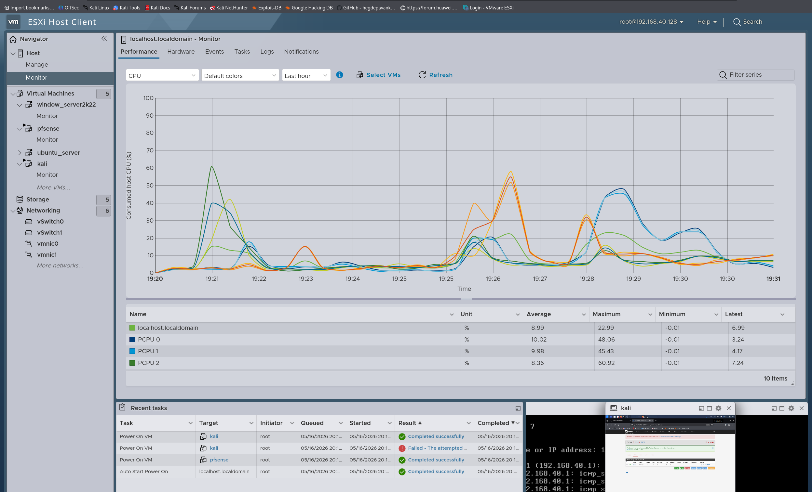

# 🖥️ VMware ESXi Bare-Metal Hypervisor Configuration

This document outlines the virtualization layer, storage distribution, and virtual switch (vSwitch) architecture implemented on the VMware ESXi host to power the enterprise Cyber Range.

## ⚙️ Hypervisor Specifications
* **Host Management IP**: `192.168.40.128` (Isolated dedicated management interface)
* **Hypervisor Platform**: VMware ESXi 7.0 / 8.0 Bare-Metal
* **Hardware Profile**: High-performance deployment optimizing CPU/RAM distribution across active Active Directory, Web Application, and Security Monitoring nodes.

---

## 🌐 Virtual Networking Architecture (vSwitches)

To enforce strict segment separation while allowing efficient virtual interface trunking, the infrastructure leverages two separate virtual switches. This design prevents direct link layer communication between the physical uplink and internal simulation layers without going through the security gateway.

### 1. `vSwitch0` - Management & WAN Gateway
Handles administrative host connection and serves as the external transit interface for the pfSense firewall.
* **Uplink**: Physical Network Interface Card (vmnic0).
* **Port Groups**:
  * **Management Network**: Dedicated to ESXi Host Client access.
  * **VM Network / WAN**: Assigned exclusively to the **pfSense WAN** interface to receive external routing.

### 2. `vSwitch1` - TRUNK_LAN (Internal Infrastructure)
A dedicated virtual switch isolated from the physical network, handling internal traffic encapsulation using **802.1Q Virtual Local Area Network (VLAN)** tagging.
* **Uplink**: Internal virtual backbone (No direct external physical mapping to prevent leakage).
* **Port Groups**: Distribution of sub-interfaces bound to specific security zones.

---

## 📊 Virtual Port Groups Mapping

| Port Group Name | VLAN ID | Associated Security Zone | Connected Virtual Machine Nodes |
| :--- | :---: | :--- | :--- |
| **VLAN10-RedTeam** | `10` | Offensive Security Zone | Kali Linux Threat Actor Node. |
| **VLAN20-Targets** | `20` | Corporate AD & Services Zone | DC01 (Windows Server 2022) & Workstation-01 (Windows 7). |
| **VLAN30-BlueTeam** | `30` | Security Operations Center (SOC) | SOC-Wazuh Engine (Ubuntu Server Deployment). |

---

## 🔒 Virtualization Security Hardening

To ensure realistic simulation behavior and secure the hypervisor environment from potential guest escape or internal network sniffing during active exploitation phases, the following layer-2 security policies are configured on **`vSwitch1`**:

1. **Promiscuous Mode**: **Reject** (Ensures VMs cannot sniff traffic traveling on the same virtual switch port group, maintaining isolation between the attacker and defender rings unless explicit routing occurs).
2. **MAC Address Changes**: **Reject** (Prevents MAC spoofing attacks inside the virtual environment that could break the pfSense static state configurations).
3. **Forged Transmits**: **Reject** (Blocks outbound frames with source MAC addresses different from the one set in the VMX configuration file).

---

## 📸 Reference Documentation Captures
*(The following configuration validations can be referenced directly inside the assets subdirectory: `../06-reports/screenshots/`)*
* **Infrastructure Inventory**: `esxi_vms.png` – Details allocation metrics per operating system.
* **Network Virtual Map**: `esxi_portgroups.png` – Validates port binding and functional active VLAN tagging.
* **Storage Allocation**: `esxi_storage.png` – Datastore metrics mapping virtual disk performance indicators.

