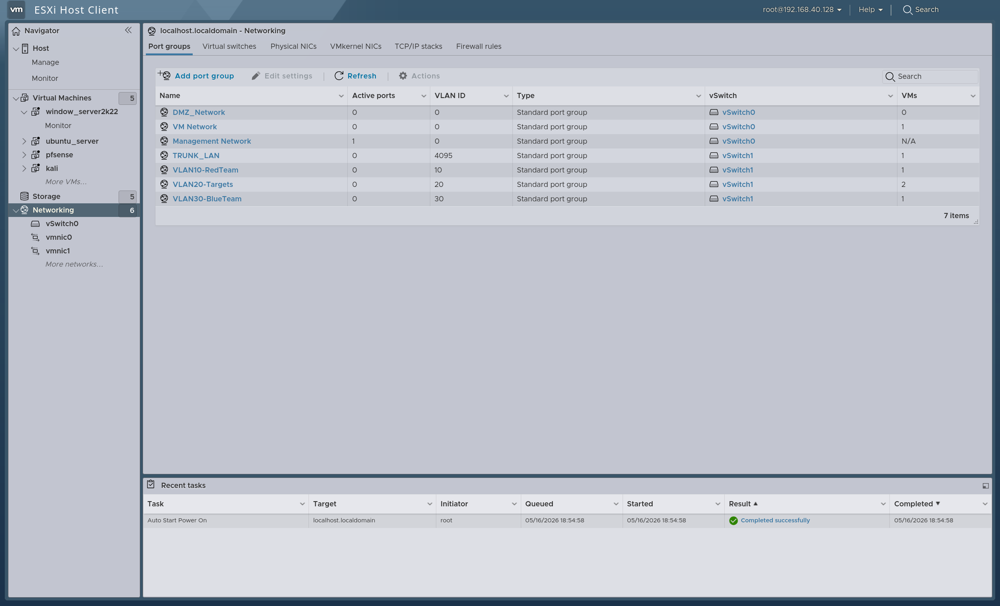
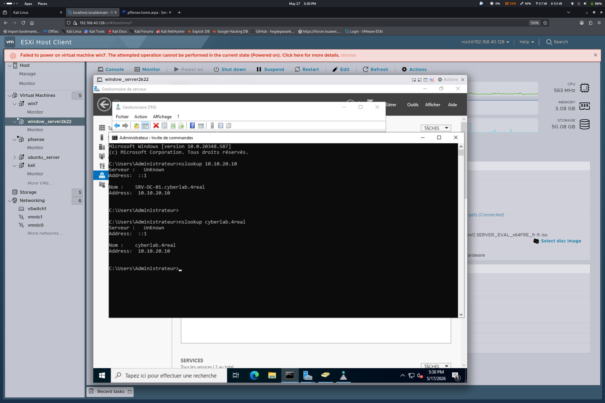
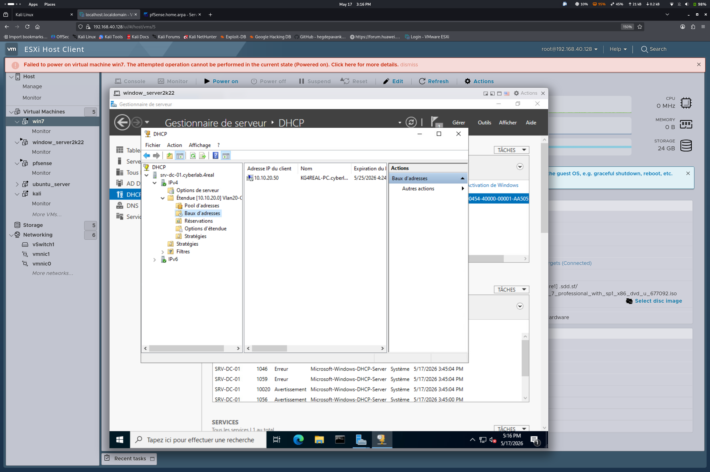

## 🗺️ IP Addressing & Network Allocation Plan

This document details the IP addressing schema, subnet allocations, and core network component mappings designed to structure the Cyber Range environment. 

## 🌐 Subnet Overview Matrix

| VLAN ID | Subnet Range | Gateway | Network Mask | Assignment / Zone |
| :---: | :--- | :--- | :---: | :--- |
| **-** | `192.168.40.0/24` | `192.168.40.1` | `255.255.255.0` | WAN / External Bridge |
| **VLAN 10** | `10.10.10.0/24` | `10.10.10.254` | `255.255.255.0` | RedTeam (Offensive Zone) |
| **VLAN 20** | `10.10.20.0/24` | `10.10.20.254` | `255.255.255.0` | Corporate Targets (Active Directory / Apps) |
| **VLAN 30** | `10.10.30.0/24` | `10.10.30.254` | `255.255.255.0` | BlueTeam / SOC (Monitoring Zone) |

---

## 🖥️ Host IP Assignments

| Asset Name | IP Address | VLAN | Interface Type | Role & Description |
| :--- | :--- | :---: | :---: | :--- |
| **pfSense-WAN** | `192.168.40.150` | - | DHCP / Static | Core Security Gateway & External NAT Interface. |
| **pfSense-LAN** | `10.10.10.254` | VLAN 10 | Static | Default Gateway for the Offensive Network. |
| **pfSense-OPT1** | `10.10.20.254` | VLAN 20 | Static | Default Gateway for Corporate Targets & Vulnerable Hosts. |
| **pfSense-OPT2** | `10.10.30.254` | VLAN 30 | Static | Default Gateway for Defensive Infrastructure. |
| **Kali-Linux** | `10.10.10.10` | VLAN 10 | Static | Attack Platform (Penetration testing & exploit execution). |
| **DC01 (Win Server 2022)** | `10.10.20.10` | VLAN 20 | Static | Active Directory Domain Controller, DNS Server, and IIS bWAPP Web Host. |
| **Workstation-01 (Win 7)** | `10.10.20.51` | VLAN 20 | Static / DHCP | Legacy Corporate Victim Client joined to the AD Domain. |
| **SOC-Wazuh (Ubuntu Server)** | `10.10.30.10` | VLAN 30 | Static | SIEM & XDR Manager deployed via Docker Compose. |

---

## 📌 Network Implementation Notes

1. **DNS Architecture**: 
   * Local name resolution within the Corporate Target Zone (`VLAN 20`) is handled natively by the Domain Controller (`10.10.20.10`). 
   * External forwarding queries are routed via the pfSense gateway interface to ensure controlled internet routing during security updates.
   
### 🌐 DNS Routing & Name Resolution Architecture

To maintain Active Directory domain integrity while allowing external web resolution for security updates, a tiered DNS architecture is implemented:

1. **Primary Directory Resolver**: The Windows Server Domain Controller (`10.10.20.10`) acts as the authoritative DNS server for the `cyberlab.4real` zone. All local domain assets are explicitly instructed via DHCP option parameters to query this node first.
2. **DNS Forwarding Pipeline**: To resolve external public domains, the Windows DNS service is configured with conditional **DNS Forwarders** pointing directly to the pfSense interface gateway (`10.10.20.254`). 
3. **Security Objective**: This layout prevents endpoint misconfigurations and ensures that internal AD operational queries remain isolated inside the target subnet, while mimicking standard corporate infrastructure traffic flows.

2. **DHCP Services**:
   * Static assignments are prioritized for critical infrastructure components (Gateways, Domain Controllers, SIEM Managers) to prevent log routing fragmentation.
   * The Windows 7 workstation can utilize AD-managed DHCP scopes within `VLAN 20` for authentic client emulation.

