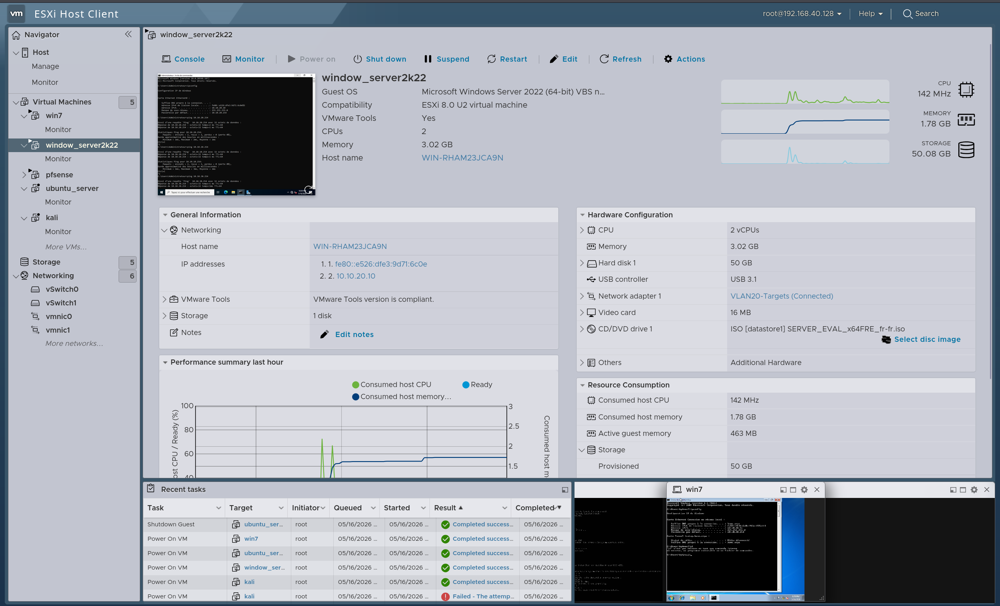

# 🏢 Active Directory Infrastructure & Identity Misconfiguration Guide

This repository module details the deployment, structure, and intentional security flaws introduced into the internal Active Directory Domain Services (AD DS) environment to facilitate enterprise-level lateral movement and identity compromise simulation scenarios.

## ⚙️ Core Domain Architecture

The foundational infrastructure simulates a small-to-medium enterprise corporate directory environment, running on a hardened bare-metal hypervisor layer with dedicated internal DNS role routing.

* **Active Directory Domain Name**: `cyberlab.4real`
* **Domain Controller Hostname**: `SRV-DC-01`
* **Primary IP Address**: `10.10.20.10` (Static / Subnet VLAN 20)
* **Operating System**: Windows Server 2022 Standard Edition
* **Core Roles Provisioned**: AD DS, DNS Server, IIS Hosting (bWAPP)

---

## 👥 Identity Access Management & Target Matrix

The directory contains specifically provisioned user accounts tailored to model realistic privilege escalation tracks. These profiles mimic common organizational vulnerabilities, including weak password habits and administrative identity over-privilege.

| SamAccountName | Display Name | Group Assignments / Access | Target Security Vulnerability |
| :--- | :--- | :--- | :--- |
| **john.doe** | John Doe | `Domain Admins`, `IT-Admins` | **Over-privileged Identity**: High-value target utilizing a weak password scheme prone to dictionary spraying. |
| **jane.smith** | Jane Smith | `CyberRange-Users` | **AS-REP Roastable**: The account has the attribute `DONT_REQ_PREAUTH` enabled, allowing unauthenticated TGT request carving. |
| **admin.service** | Service Admin | `CyberRange-Users` | **Kerberoastable Account**: Assigned a Service Principal Name (SPN). TGS tickets can be requested by any authenticated user and cracked offline. |

---

## 🔓 Intentionally Configured AD Vulnerabilities & Lab Flaws

To mirror the complex, legacy configuration debt often found in real-world corporate networks, several specific domain settings and protocol anomalies have been activated on `SRV-DC-01`:

### 1. Link-Local Multicast Name Resolution (LLMNR) Enabled
* **Technical Impact**: The network retains broadcast name resolution fallback. This allows an attacker in the Red Team zone (`VLAN 10`) to perform LLMNR/NBT-NS spoofing (via tools like Responder) to harvest domain hashes when client nodes attempt to resolve non-existent network shares.

### 2. Password Complexity Policies Disabled
* **Technical Impact**: Fine-Grained Password Policies (FGPP) and default domain complexity checks are deactivated. This simulates a weak password baseline across the environment, making user profiles heavily susceptible to offline brute-forcing and wordlist matching.

### 3. Domain-Wide Remote Management (WinRM Enabled)
* **Technical Impact**: Windows Remote Management is listening over HTTP (Ports `5985/5986`). Once credentials or administrative hashes are intercepted during early kill-chain phases, attackers can pivot directly using automated scripting tools (e.g., Evil-WinRM) to establish non-interactive command-line interfaces on domain nodes.

### 4. Over-Permissive Network Shares (`C:\Share`)
* **Technical Impact**: A network file share is exposed with permissions assigned to the built-in identity group `Everyone`. This mimics insecure configuration states where sensitive data, configuration scripts containing cleartext credentials, or internal topology plans leak to unprivileged network vectors.

### 5. OS-Level Host Firewall Disabled (Domain Profile)
* **Technical Impact**: Local Windows Defender Firewall filtering has been disabled across the testing profile. This configuration ensures unrestricted port analysis visibility for internal scanning toolsets (e.g., Nmap) and prevents local rule drops from masking network artifact footprinting during Blue Team validation testing.

---

## 🛡️ Forensic Validation & SIEM Integration Blueprint

Each simulated vulnerability is designed to generate distinct, actionable events for telemetry validation within the security monitoring infrastructure:

1. **AS-REP / Kerberoasting Detection**: Monitored via Windows Security Event Logs (`Event ID 4768` - A Kerberos authentication ticket was requested, and `Event ID 4769` - A Kerberos service ticket was requested). The **Wazuh Agent** streams these hashes to detect anomalous encryption downgrade requests (such as RC4/`0x17` implementations).
2. **Identity Escalation Tracks**: Compromising `john.doe` allows full Active Directory replication dumping (`DCSync`), creating immediate alerts within the SIEM cluster through the auditing of active directory access changes.

