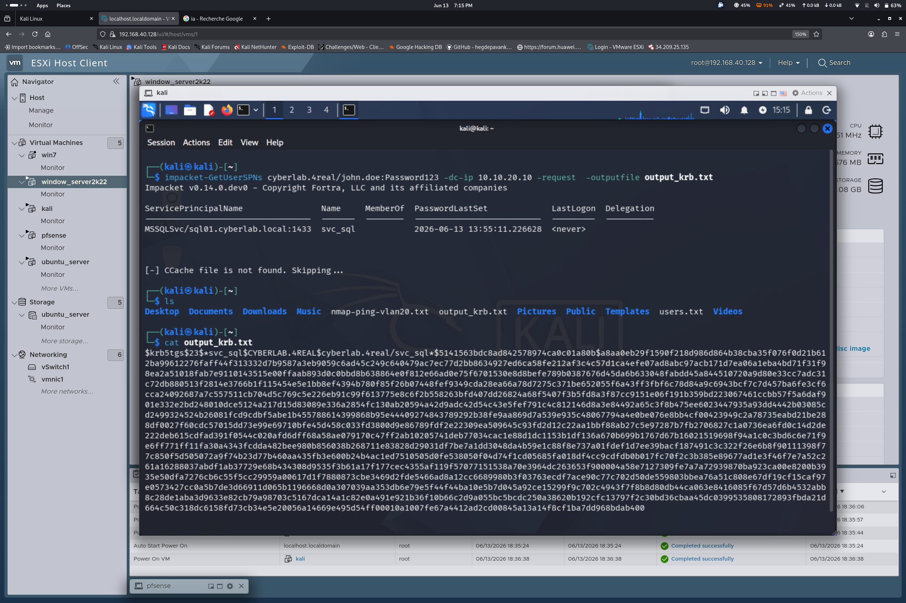
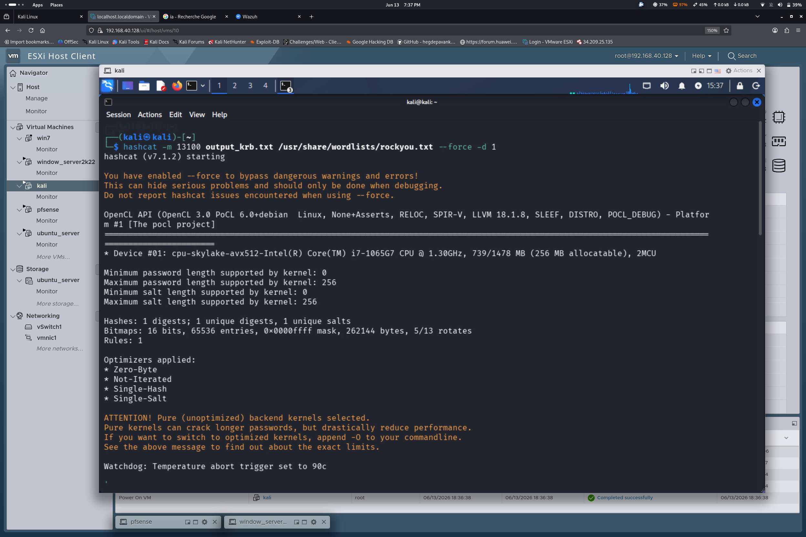
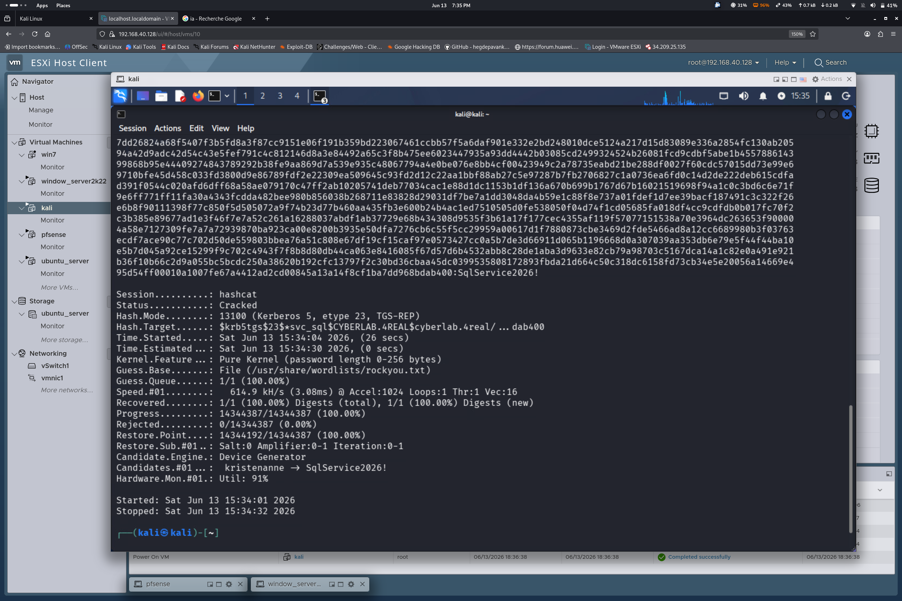
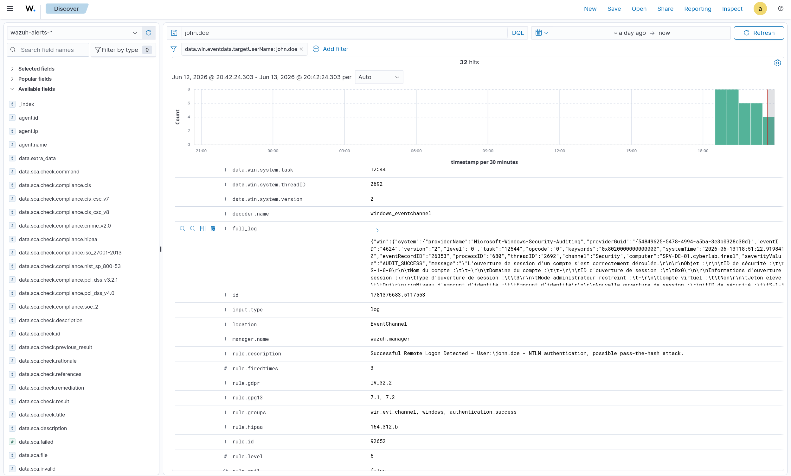
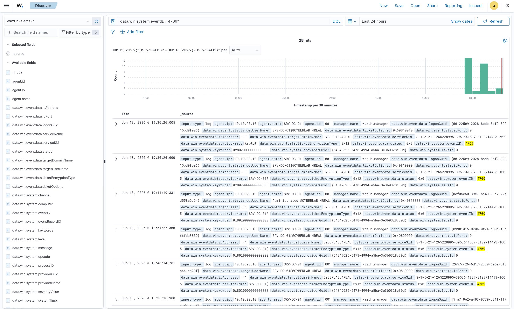

# Scenario 02 — Kerberoasting: Executing and Detecting the Attack with Impacket and Wazuh


Welcome to the second practical scenario of the CyberRange-ESXi series.

In **Scenario 01**, initial foothold inside the domain was established by compromising the credentials of a standard domain user, `john.doe`. Standard user access is a great start, but it does not grant administrative control over the network. To elevate privileges, the next step is to look for high-value targets within the infrastructure.

This scenario explores **Kerberoasting** — one of the most common and effective post-exploitation techniques used by threat actors to target Active Directory service accounts. It follows a full **Purple Team** approach, split into two phases:

- **Red Team Phase:** abuse the initial access as `john.doe` to query the Domain Controller using Impacket, harvest Kerberos Ticket Granting Service (TGS) tickets for service accounts, and crack them offline using Hashcat.
- **Blue Team Phase:** pivot to the defender's perspective and analyze how the SOC detects this stealthy attack by centralizing Windows Event logs into Wazuh XDR.

---

## I. Environment Architecture & Lab Setup

| Component | Details |
|---|---|
| **Domain Controller (`SRV-DC-01`)** | Windows Server 2022 — manages the `cyberlab.4real` domain, handles Kerberos auth, runs the Wazuh Agent |
| **Attacker Machine** | Kali Linux — same network segment, pre-configured with security tooling |
| **SIEM / XDR** | Wazuh Manager deployed via Docker on a dedicated Linux server |

---

## II. Red Team Phase: Exploitation & Hash Cracking

With initial access via `john.doe` established in Scenario 01, the attack proceeds with the Kerberoasting vector.

### 1. Enumerating and Requesting Service Tickets (TGS)

Using the Impacket toolset from the Kali machine, Active Directory is queried for accounts with non-empty **Service Principal Names (SPNs)**, requesting a Kerberos ticket for each one.

```bash
impacket-GetUserSPNs cyberlab.4real/john.doe:Password123 \
    -dc-ip 10.10.20.10 \
    -request \
    -outputfile output_krb.txt
```



### 2. Offline Password Cracking (Hashcat)

Once the Kerberos TGS ticket for the service account `svc_sql` was extracted and saved, it was cracked offline to retrieve the plain-text password, using **Hashcat** mode `13100` (Kerberos 5 TGS-REP etype 23):

```bash
hashcat -m 13100 output_krb.txt perso.txt --force
```



The dictionary attack completed within seconds, successfully revealing the service account credentials.



**Resulting plain-text password:** `SqlService2026!`

By recovering this password, a threat actor would gain administrative privileges over the database service — a successful **horizontal/vertical privilege escalation**.

---

## III. Blue Team Phase: SIEM Detection & Analysis

Pivoting to the defensive perspective: security monitoring must identify the early stages of this attack before an adversary can pivot deeper into the domain.

### 1. Catching the Authentication Pattern

The centralized monitoring platform, **Wazuh**, intercepted the remote authentication used during the ticket-request phase and correlated it into a high-severity alert:



> ⚠️ **Alert:** `Successful Remote Logon Detected - NTLM authentication, possible pass-the-hash attack`

**Mapped MITRE ATT&CK Techniques:**

| Technique | ID | Tactic |
|---|---|---|
| Pass the Hash | `T1550.002` | Defense Evasion / Lateral Movement |
| Domain Accounts | `T1078.002` | Initial Access / Privilege Escalation |

### 2. Advanced Active Directory Auditing (Event ID 4769)

To gain granular visibility into Kerberoasting attempts, advanced audit policies were configured on Windows Server by enabling the **Kerberos Service Ticket Operations** subcategory:

```cmd
auditpol /set /subcategory:"{0CCE9242-69AE-11D9-BED3-505054503030}" /success:enable /failure:enable
```

Once activated, any TGS ticket request generates an **Event ID 4769** in the Windows Security log. Wazuh parses these logs to trace which service accounts are being targeted.



---

## 🛡️ Mitigation & Hardening Recommendations

Defending against Kerberoasting requires a **multi-layered defense strategy**:

1. **Strong Service Account Passwords** — enforce complex, randomly generated passwords of **25+ characters**. Ideally, migrate to **Group Managed Service Accounts (gMSAs)** for automatic password rotation.
2. **Enforce Strong Encryption** — disable legacy algorithms like **RC4 (`0x17`)** at the domain level. Force the exclusive use of **AES-128 / AES-256 (`0x12`)** for Kerberos authentication.
3. **Least Privilege Principle** — service accounts should **never** belong to high-privilege groups (Domain Admins, Account Operators) unless strictly necessary.

---

## Conclusion

This scenario demonstrates the value of a **Purple Team mindset**: understanding the offensive mechanics of Kerberoasting made it possible to configure precise auditing policies and confirm the SIEM (Wazuh) provides the visibility needed to detect credential theft early.

Next up: **[Scenario 03 — AS-REP Roasting](../03-asrep-roasting/README.md)**.

---

*Part of the [CyberRange-ESXi](https://github.com/Kg4REAL/CyberRange-ESXi) series — a Purple Team home lab built on VMware ESXi.*
