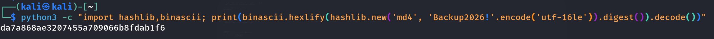
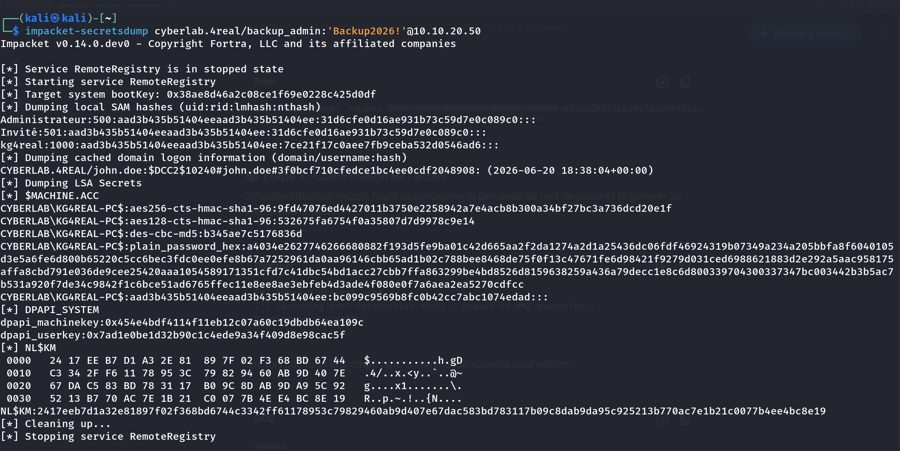
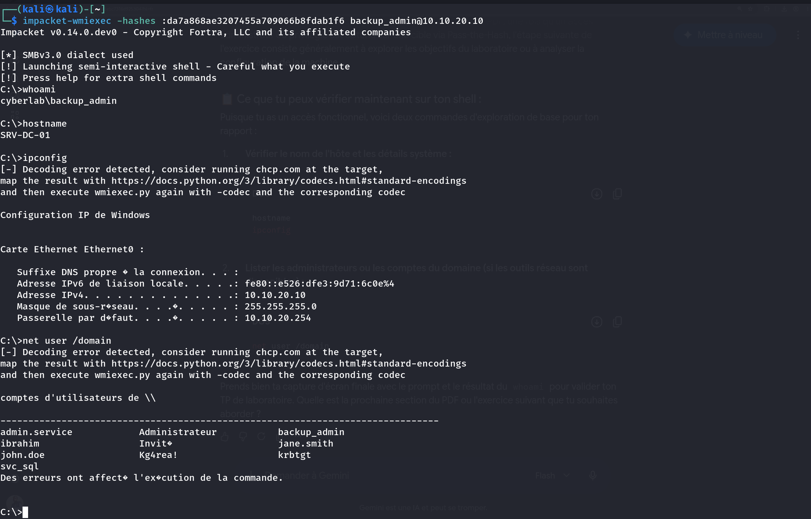
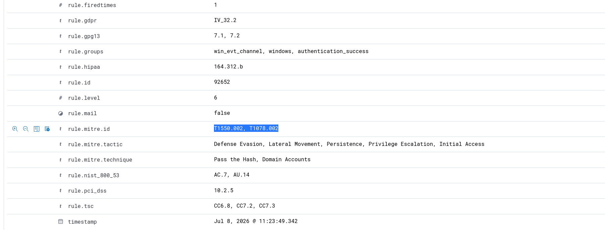
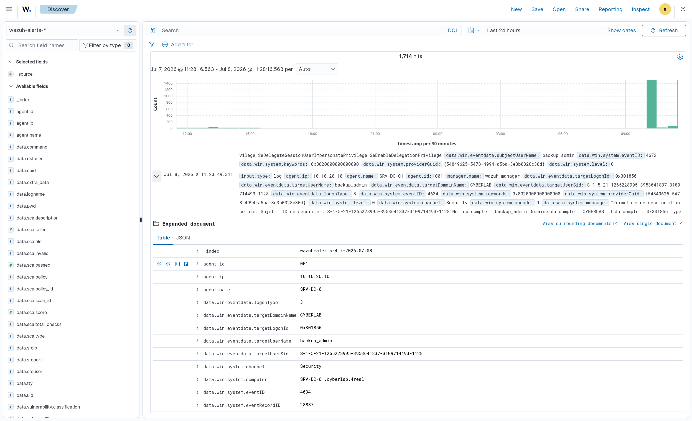
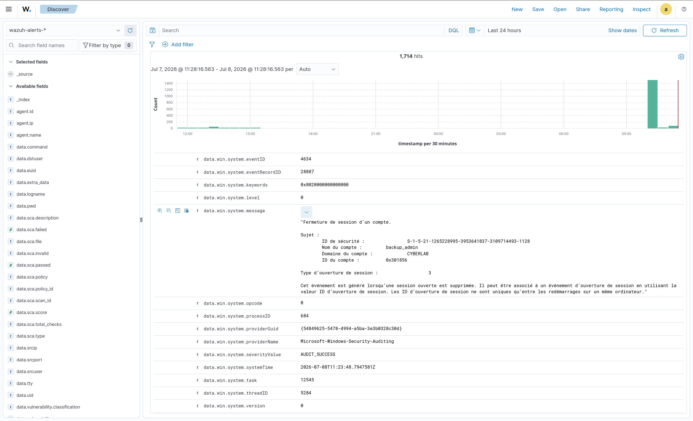

# Scenario 04 — Pass-the-Hash (PtH): Lateral Movement & Detection with Wazuh


[](https://medium.com/@ibrahimadia759/scenario-3-lateral-movement-executing-and-detecting-pass-the-hash-pth-with-wazuh-14cadbb2ce64)

## 📝 Overview

This scenario picks up the lateral movement phase of the Active Directory kill-chain: simulating a **Pass-the-Hash (PtH)** attack using a captured NTLM hash to authenticate as a privileged account — without ever knowing or cracking its plaintext password — and engineering a custom, high-priority detection rule inside **Wazuh SIEM** to catch it.

A full step-by-step write-up (including every GPO pitfall and log-analysis detail) is available on Medium:

🔗 **[Read the full article](https://medium.com/@ibrahimadia759/scenario-3-lateral-movement-executing-and-detecting-pass-the-hash-pth-with-wazuh-14cadbb2ce64)**

---

## 🏗️ Lab Architecture

| Role | Machine | Details |
|---|---|---|
| Attacker | Kali Linux (`kg4real`) | 10.10.10.10 |
| Target (DC) | Windows Server 2022 Datacenter | `SRV-DC-01` / `CYBERLAB.4REAL` — 10.10.20.10 |
| SIEM / XDR | Wazuh Manager | Ubuntu Server, deployed via Docker |

---

## 🔴 Red Team: Attack Execution

### Step 1 — NTLM Hash Retrieval

The NTLM hash of the `backup_admin` service account was extracted from the Domain Controller.



### Step 2 — secretsdump Confirmation

```bash
impacket-secretsdump cyberlab.4real/backup_admin@10.10.20.10
```



### Step 3 — Pass-the-Hash via Impacket wmiexec

Using **Impacket's `wmiexec`**, a remote semi-interactive shell was spawned against the target Domain Controller using the pre-extracted NTLM hash of the `backup_admin` account — **without ever cracking the cleartext password**:

```bash
impacket-wmiexec -hashes :da7a868ae3207455a709066b8fdab1f6 backup_admin@10.10.20.10
```



---

## 🔵 Blue Team: Defensive Engineering

### 1. Agent Configuration (`ossec.conf`)

The default Windows agent configuration filters out many critical events. To ensure full visibility over the `Security` log channel, the default `<query>` filters were removed to allow 100% log ingestion:

```xml
<localfile>
  <location>Security</location>
  <log_format>eventchannel</log_format>
</localfile>
```

### 2. Active Directory GPO Auditing

To prevent local policies (`secpol.msc`) from being silently overwritten by the Domain Controller's baseline policy, auditing was enforced **domain-wide** via **`gpmc.msc`** (*Default Domain Controllers Policy*):

- **Audit Policy:** `Audit logon events` → enforced on **Success** & **Failure**.

---

## 🎯 Indicators of Compromise (IOCs) & Custom Rule

The attack triggers a specific combination of telemetry fields inside Windows **Event ID 4624** (Successful Logon):

| Field | Value | Why it matters |
|---|---|---|
| `win.eventdata.logonType` | `3` | Network logon via SMB/WMI — no interactive session precedes it |
| `win.eventdata.authenticationPackageName` | `NTLM` | Abnormal fallback instead of Kerberos for a domain-joined environment |

### Custom Wazuh Rule (`local_rules.xml`)

A custom **Level 12 (Critical)** rule was engineered to intercept the generic native Wazuh alert (`92652`), focus specifically on the highly privileged `backup_admin` account, and flag it instantly for the SOC team:

```xml
<group name="windows, authentication_success,">
  <rule id="100020" level="12">
    <if_sid>92652</if_sid>
    <field name="win.eventdata.targetUserName">^backup_admin$</field>
    <description>CRITICAL ALERT - Pass-the-Hash (PtH) Attack Detected via WMIexec on backup_admin account!</description>
    <mitre>
      <id>T1550.002</id>
    </mitre>
  </rule>
</group>
```



### Alert Validation

Once the rule was loaded, re-running the attack triggered an immediate, high-severity alert in the Wazuh dashboard:





---

## 🛡️ Mitigation & Hardening

1. **Enforce Credential Guard** on Windows 10/11 and Server 2016+ to prevent LSASS credential extraction.
2. **Disable NTLM where possible** — enforce Kerberos-only authentication and restrict NTLM via GPO (`Network security: Restrict NTLM`).
3. **LAPS (Local Administrator Password Solution)** — unique, rotated local admin passwords prevent a single dumped hash from granting lateral movement across every machine.
4. **Tier your admin accounts** — privileged accounts like `backup_admin` should never authenticate on lower-tier workstations, limiting where their hash can be harvested.

---

## 🏆 MITRE ATT&CK Mapping

| Field | Value |
|---|---|
| Tactics | Lateral Movement (`TA0008`), Defense Evasion (`TA0005`) |
| Technique | Use Alternate Authentication Material: Pass the Hash (`T1550.002`) |
| Platform | Windows Active Directory |

---

## Screenshots

| File | Description |
|---|---|
| `generation_hash_ntlm.png` | NTLM hash retrieval context for `backup_admin` |
| `secretdump_success.png` | `secretsdump` output confirming the extracted hash |
| `pth_wmiexec_shell.png` | Successful remote shell via `wmiexec`, authenticated with the hash only |
| `rule_mittre_attack.png` | Custom Wazuh rule `100020`, mapped to MITRE T1550.002 |
| `dectection_de_pth_sur_wazuh.png` | Wazuh dashboard — PtH alert triggered |
| `wahuh_deatil.png` | Wazuh alert detail view — full event fields |

---

## Related Scenarios

| Scenario | Link |
|---|---|
| Scenario 03 — AS-REP Roasting | [README](../03-asrep-roasting/README.md) |
| Scenario 05 — Overpass-the-Hash | Coming next |

---

*Part of the [CyberRange-ESXi](https://github.com/Kg4REAL/CyberRange-ESXi) Purple Team Lab*
