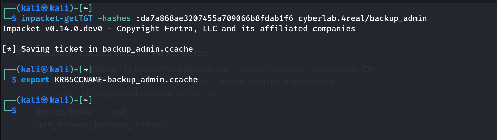
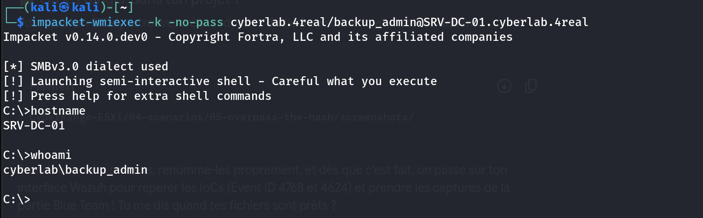
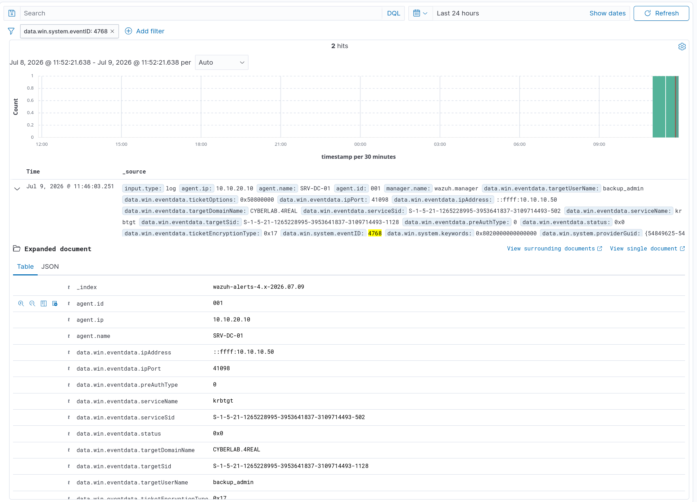
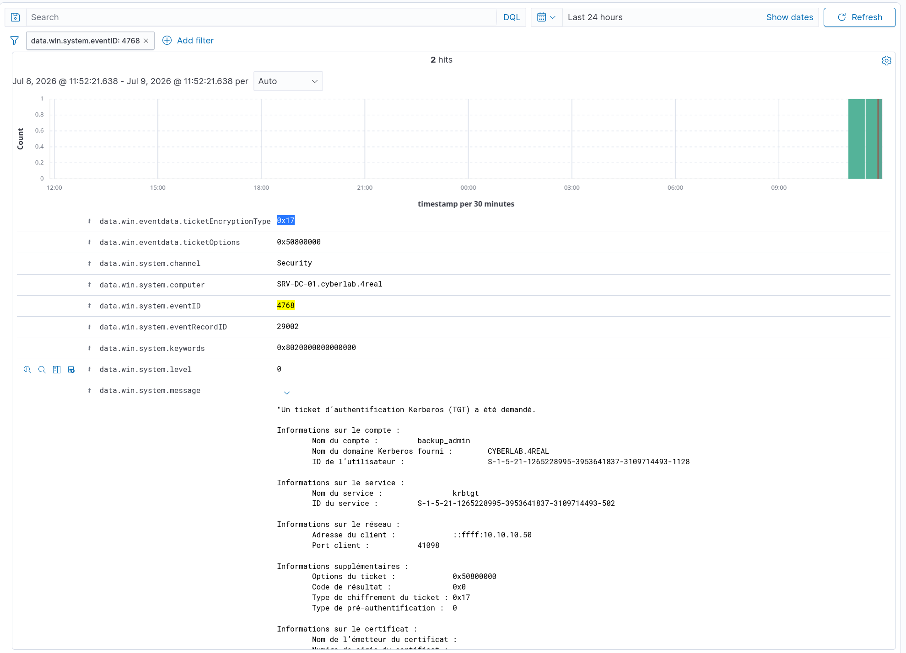
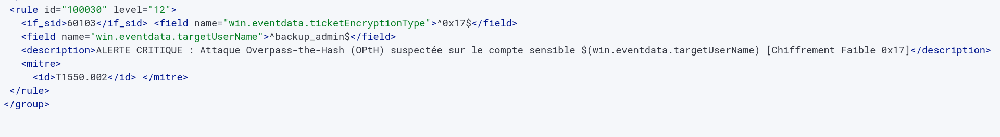
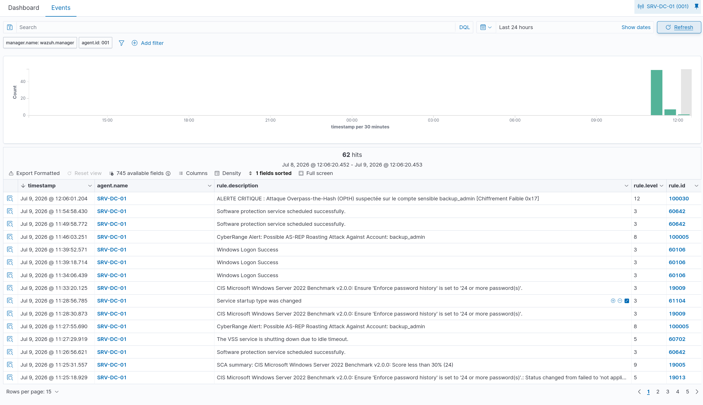

# Scenario 5: Lateral Movement — Overpass-the-Hash (OPtH) Detection

## Overview
In this scenario, we upgrade our lateral movement techniques from standard Pass-the-Hash (NTLM-bound) to **Overpass-the-Hash (OPtH)**. Instead of using the NTLM hash directly to authenticate against services via SMB, we use the stolen NTLM hash to **request a legitimate Kerberos Ticket Granting Ticket (TGT)** from the Key Distribution Center (KDC). This transitions the attack session into a fully legitimate Kerberos context, bypassing traditional NTLM-only monitoring.

---

## Architecture Refresher
* **Attacker:** Kali Linux (`kg4real`)
* **Target:** Windows Server 2022 Datacenter (Domain Controller `SRV-DC-01.cyberlab.4real`)
* **SIEM/XDR:** Wazuh Manager (Docker Stack)

---

## 🔴 Red Team Phase: Executing Overpass-the-Hash

Using **Impacket's `getTGT.py`**, we leverage the NT hash of our compromised `backup_admin` account to request a Kerberos TGT from the DC.

### Step 1: Requesting the TGT

\`\`\`bash
impacket-getTGT -hashes :da7a868ae3207455a709066b8fdab1f6 cyberlab.4real/backup_admin
\`\`\`

This saves a valid Kerberos ticket into `backup_admin.ccache`.

### Step 2: Injecting the Ticket & Lateral Movement

We export the ticket into our environment and execute commands via a semi-interactive shell using `wmiexec` in full Kerberos mode (`-k -no-pass`):

\`\`\`bash
export KRB5CCNAME=backup_admin.ccache
impacket-wmiexec -k -no-pass cyberlab.4real/backup_admin@SRV-DC-01.cyberlab.4real
\`\`\`

At this point, we have a fully functional remote shell on the Domain Controller, authenticated through a legitimate Kerberos ticket rather than an NTLM handshake — making this technique significantly harder to catch with NTLM-centric monitoring alone.

---

## 🔵 Blue Team Phase: SIEM Detection & Engineering

### 1. Analyzing the IoC (Indicators of Compromise)

When an attacker requests a TGT using a legacy NT hash through tools like Impacket, Windows generates an **Event ID 4768** (A Kerberos authentication ticket (TGT) was requested).

Key anomalies observed in the raw logs:

* **Service Name:** `krbtgt`
* **Ticket Encryption Type:** `0x17` (RC4-HMAC). This is the smoking gun. Modern Active Directory environments should use AES (`0x12`), but Impacket's `getTGT` falls back to RC4 when leveraging an NT hash.

### 2. Custom Detection Rule Engineering

We engineered a custom Level 12 (Critical) Wazuh rule inside `local_rules.xml` to immediately flag any TGT requested with the obsolete `0x17` cipher targeting high-privilege accounts.

\`\`\`xml
<group name="windows, authentication_success,">
  <rule id="100030" level="12">
    <if_sid>60103</if_sid>
    <field name="win.eventdata.ticketEncryptionType">^0x17$</field>
    <field name="win.eventdata.targetUserName">^backup_admin$</field>
    <description>CRITICAL ALERT: Overpass-the-Hash (OPtH) Attack Suspected on Account $(win.eventdata.targetUserName) [Weak Cipher 0x17]</description>
    <mitre>
      <id>T1550.002</id>
    </mitre>
  </rule>
</group>
\`\`\`

### 3. Verification

Once applied, executing the attack triggers a high-severity alert on the Wazuh Security Dashboard instantly:

---

## Mitigation & Recommendations

* **Credential Guard** — isolates LSASS memory to prevent NT hash extraction.
* **Enforce AES-only Kerberos** — disable RC4 (`0x17`) at the domain/GPO level via `msDS-SupportedEncryptionTypes`.
* **LAPS** — enforce unique local admin passwords per host to limit hash reuse impact.
* **Tiering Model** — segregate privileged accounts (Tier 0/1/2) to contain lateral movement blast radius.

---

## MITRE ATT&CK Mapping

| Tactic | Technique | ID |
|---|---|---|
| Lateral Movement | Use Alternate Authentication Material: Pass the Hash | T1550.002 |

---

## Series Navigation

| Scenario | Title | Status |
|---|---|---|
| 01 | Recon & Password Spraying | ✅ |
| 02 | Kerberoasting | ✅ |
| 03 | AS-REP Roasting | ✅ |
| 04 | Pass-the-Hash (PtH) | ✅ |
| **05** | **Overpass-the-Hash (OPtH)** | ✅ |
