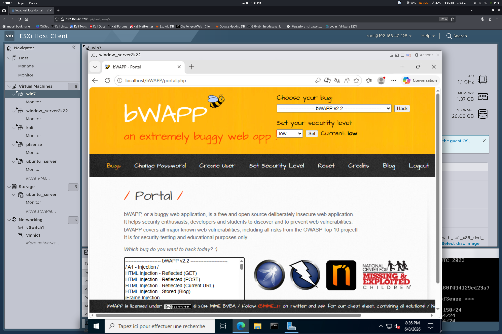

# Scenario 16 — Web Exploitation


## Target

The vulnerable **bWAPP** application, deployed on IIS on the domain-joined web server (see [01-infrastructure/server_web](../../01-infrastructure/server_web/README.md)).



## MITRE ATT&CK
- T1190 — Exploit Public-Facing Application
- T1059 — Command and Scripting Interpreter

## Tools
- Nikto
- SQLmap
- Burp Suite

## Commands

### Web scan
```bash
nikto -h http://10.10.20.10
```

### SQLi
```bash
sqlmap -u "http://10.10.20.10/login.php?id=1" --dbs
```

## Detection
See: 05-detection/wazuh-rules/03-web-detection.md
