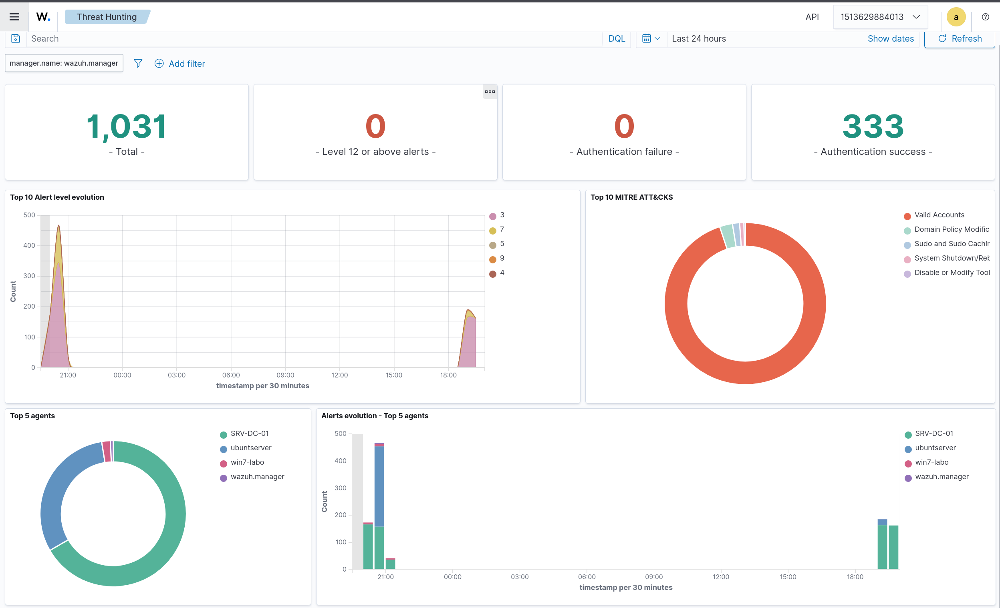

# CyberRange-ESXi 🔴🔵

> Enterprise Purple Team lab built on VMware ESXi — Active Directory, pfSense VLAN segmentation, Wazuh SIEM, full Red/Blue Team scenarios with attack documentation & detection rules.




## Tech Stack

**🔴 Red Team**


**🔵 Blue Team**


**⚙️ Infrastructure**


## Architecture


## Network

| Host | IP | VLAN | Role |
|---|---|---|---|
| pfSense WAN | 192.168.40.150 | - | Firewall / Router |
| pfSense OPT1 | 10.10.10.254 | VLAN10 | RedTeam Gateway |
| pfSense OPT2 | 10.10.20.254 | VLAN20 | Targets Gateway |
| pfSense OPT3 | 10.10.30.254 | VLAN30 | SOC Gateway |
| Kali Linux | 10.10.10.10 | VLAN10 | Attacker |
| Windows Server 2022 | 10.10.20.10 | VLAN20 | DC01 / AD |
| Windows 7 | 10.10.20.51 | VLAN20 | Victim workstation |
| Ubuntu Server | 10.10.30.10 | VLAN30 | Wazuh SIEM |

## Infrastructure

### ESXi


### pfSense


### Active Directory


### Win7 Domain Join


## Scenarios

Full Active Directory attack chain, from initial recon to domain persistence.

| # | Scenario | Technique | MITRE | Status |
|---|---|---|---|---|
| 00 | [Network Reconnaissance & Domain Enumeration](https://medium.com/@ibrahimadia759/scenario-0-network-reconnaissance-domain-enumeration-c0fa085f516c) | Nmap, enum4linux | T1046 | ✅ |
| 01 | [Recon, Password Spraying & Domain Compromise](https://medium.com/@ibrahimadia759/senario-1-red-team-vs-blue-team-how-to-execute-a-kerberoasting-attack-and-detect-it-using-wazuh-13185ea39272) | Nmap, enum4linux, NetExec | T1046, T1110.003 | ✅ |
| 02 | [Kerberoasting Attack & Detection](https://medium.com/@ibrahimadia759/scenario-2-cracking-and-detecting-as-rep-roasting-with-wazuh-04c2842bf7b0) | Impacket GetUserSPNs, Hashcat | T1558.003 | ✅ |
| 03 | [AS-REP Roasting Attack & Detection](https://medium.com/@ibrahimadia759/scenario-3-lateral-movement-executing-and-detecting-pass-the-hash-pth-with-wazuh-14cadbb2ce64) | Impacket GetNPUsers, John the Ripper | T1558.004 | ✅ |
| 04 | [Pass-the-Hash & Lateral Movement](https://medium.com/@ibrahimadia759/scenario-4-lateral-movement-executing-and-detecting-overpass-the-hash-opth-with-wazuh-6314f4b55f8a) | secretsdump, NetExec, wmiexec | T1550.002 | ✅ |
| 05 | [Overpass-the-Hash Attack & Detection](https://medium.com/@ibrahimadia759/scenario-5-pass-the-ticket-ptt-attack-siem-detection-4c22a788ef72) | Impacket getTGT, NTLM hash → forged Kerberos TGT | T1550.002 | ✅ |
| 06 | [Pass-the-Ticket (PtT) Attack & Detection](04-scenarios/06-pass-the-ticket/README.md) | Stolen/replayed Kerberos tickets | T1550.003 | ✅ |
| 07 | [LLMNR/NBT-NS Poisoning & NTLM Relay](04-scenarios/07-llmnr-ntlm-relay/README.md) | Responder, ntlmrelayx | T1557.001 | 🔜 |
| 08 | ACL Abuse (BloodHound attack paths) | GenericAll, WriteDACL, ForceChangePassword | T1222 | 🔜 |
| 09 | Delegation Abuse | Unconstrained / constrained Kerberos delegation | T1558 | 🔜 |
| 10 | DCSync | Credential dumping via directory replication | T1003.006 | 🔜 |
| 11 | Golden Ticket | Forged TGT using the krbtgt hash | T1558.001 | 🔜 |
| 12 | Silver Ticket | Forged TGS for a specific service | T1558.002 | 🔜 |
| 13 | [Privilege Escalation](04-scenarios/13-privesc/README.md) | WinPEAS, LinPEAS | T1068, T1078 | 🔜 |
| 14 | [Persistence](04-scenarios/14-persistence/README.md) | Registry/scheduled task, Skeleton Key, DCShadow | T1547.001, T1053.005 | 🔜 |
| 15 | GPO Abuse | Malicious Group Policy Object push | T1484.001 | 🔜 |
| 16 | [Web Exploitation](04-scenarios/16-web-exploitation/README.md) | Nikto, SQLmap, Burp Suite | T1190 | 🔜 |

Detection rules, IOCs, and the full MITRE ATT&CK mapping for every scenario live in [`05-detection/`](05-detection/).

## 📚 Technical Writeups on Medium

Read the complete step-by-step guides and SIEM detection strategies:

- **[Building a High-Performance Cyber Range with ESXi & Active Directory](https://medium.com/@ibrahimadia759/building-a-high-performance-cyber-range-with-esxi-active-directory-12afdeabee15)** — Infrastructure architecture & deployment guide
- **[Scenario 0: Network Reconnaissance & Domain Enumeration](https://medium.com/@ibrahimadia759/scenario-0-network-reconnaissance-domain-enumeration-c0fa085f516c)** — Initial foothold techniques
- **[Scenario 1: Red Team vs Blue Team — Kerberoasting Attack & Wazuh Detection](https://medium.com/@ibrahimadia759/senario-1-red-team-vs-blue-team-how-to-execute-a-kerberoasting-attack-and-detect-it-using-wazuh-13185ea39272)** — Complete attack-defense scenario
- **[Scenario 2: Cracking & Detecting AS-REP Roasting with Wazuh](https://medium.com/@ibrahimadia759/scenario-2-cracking-and-detecting-as-rep-roasting-with-wazuh-04c2842bf7b0)** — Pre-authentication attacks & SIEM rules
- **[Scenario 3: Pass-the-Hash (PtH) Attack & Lateral Movement Detection](https://medium.com/@ibrahimadia759/scenario-3-lateral-movement-executing-and-detecting-pass-the-hash-pth-with-wazuh-14cadbb2ce64)** — Credential dumping & lateral movement
- **[Scenario 4: Overpass-the-Hash (OPtH) & Kerberos TGT Forging](https://medium.com/@ibrahimadia759/scenario-4-lateral-movement-executing-and-detecting-overpass-the-hash-opth-with-wazuh-6314f4b55f8a)** — Advanced Kerberos attacks
- **[Scenario 5: Pass-the-Ticket (PtT) Attack & SIEM Detection](https://medium.com/@ibrahimadia759/scenario-5-pass-the-ticket-ptt-attack-siem-detection-4c22a788ef72)** — Ticket injection & Mimikatz extraction

## Structure

```
CyberRange-ESXi/
├── 01-infrastructure/    # ESXi, pfSense, network diagrams
├── 02-active-directory/  # AD setup & config
├── 03-soc-wazuh/         # Wazuh installation & config
├── 04-scenarios/         # Attack walkthroughs (01 → 16)
├── 05-detection/         # Wazuh rules, IOCs & MITRE mapping
└── 06-reports/           # Incident-response template & screenshots
```

## Roadmap

- [x] Infrastructure build-out (ESXi, pfSense, VLAN segmentation, AD, Wazuh)
- [x] Scenario 00 — Network Reconnaissance & Domain Enumeration
- [x] Scenario 01 — Recon, Password Spraying & Domain Compromise
- [x] Scenario 02 — Kerberoasting
- [x] Scenario 03 — AS-REP Roasting
- [x] Scenario 04 — Pass-the-Hash
- [x] Scenario 05 — Overpass-the-Hash
- [x] Scenario 06 — Pass-the-Ticket
- [ ] Scenario 07 — LLMNR/NBT-NS Poisoning & NTLM Relay
- [ ] Scenario 08 — ACL Abuse (BloodHound attack paths)
- [ ] Scenario 09 — Delegation Abuse
- [ ] Scenario 10 — DCSync
- [ ] Scenario 11 — Golden Ticket
- [ ] Scenario 12 — Silver Ticket
- [ ] Scenario 13 — Privilege Escalation
- [ ] Scenario 14 — Persistence
- [ ] Scenario 15 — GPO Abuse
- [ ] Scenario 16 — Web Exploitation
- [ ] Full incident-response report using the [IR template](06-reports/incident-response/ir-template.md)

## Author

**Ibrahima Dia** — Cybersecurity Researcher & Systems/Networks Student | Purple Team Specialist

[](https://www.linkedin.com/in/ibrahima-dia-cyber)
[](https://github.com/Kg4REAL)
[](https://medium.com/@ibrahimadia759)
