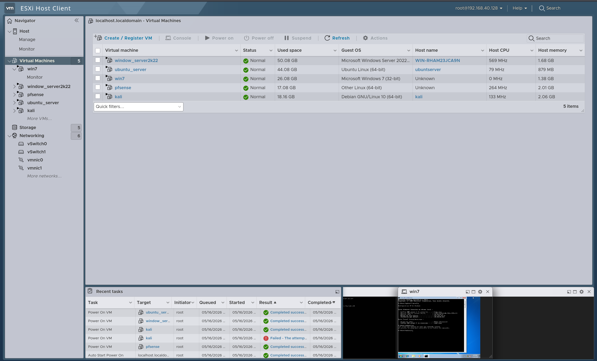
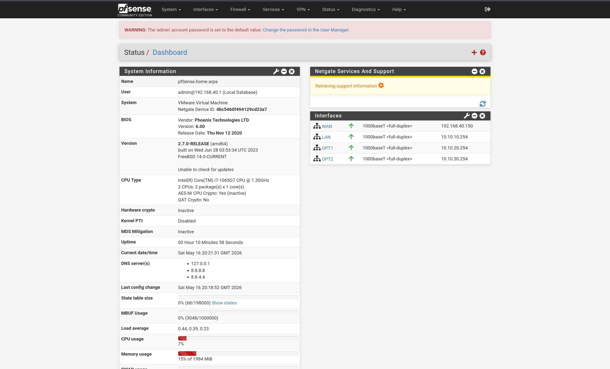
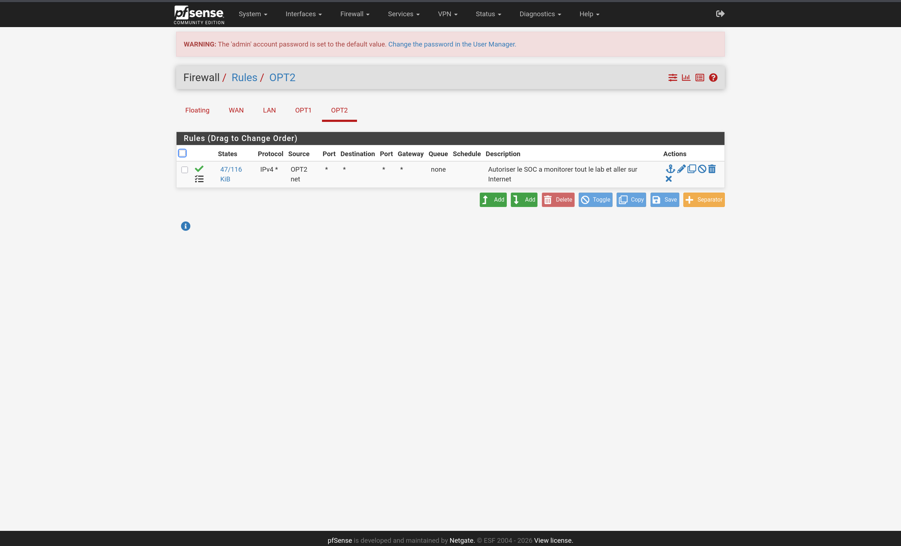
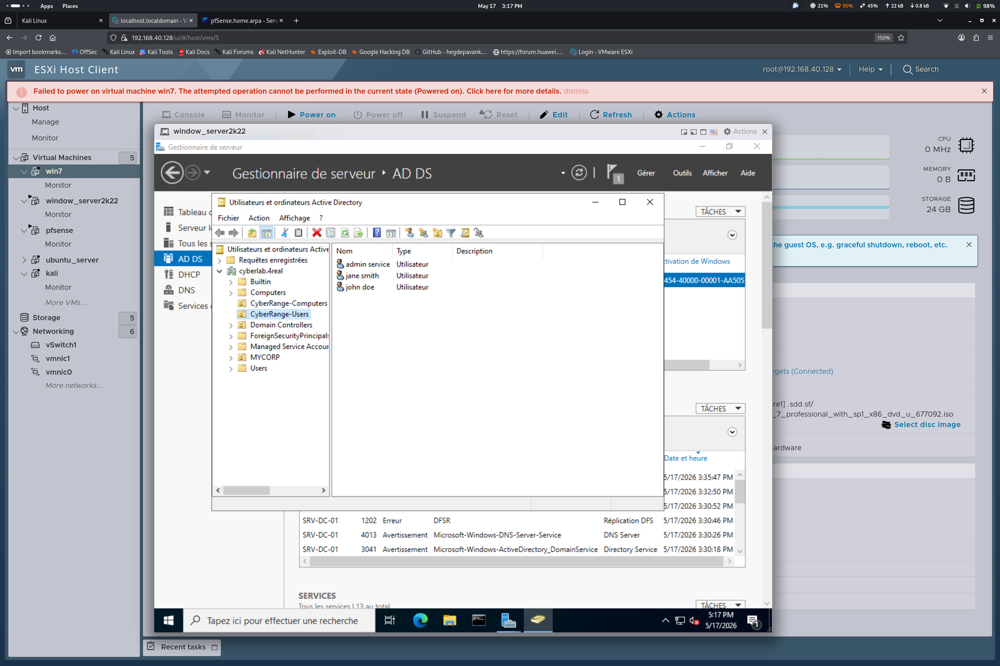
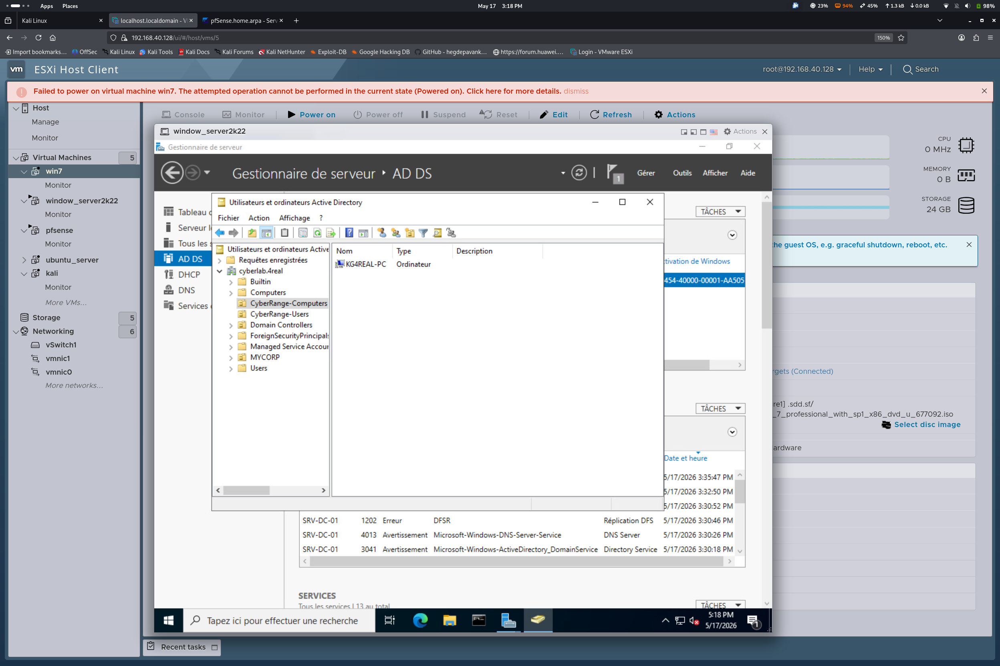
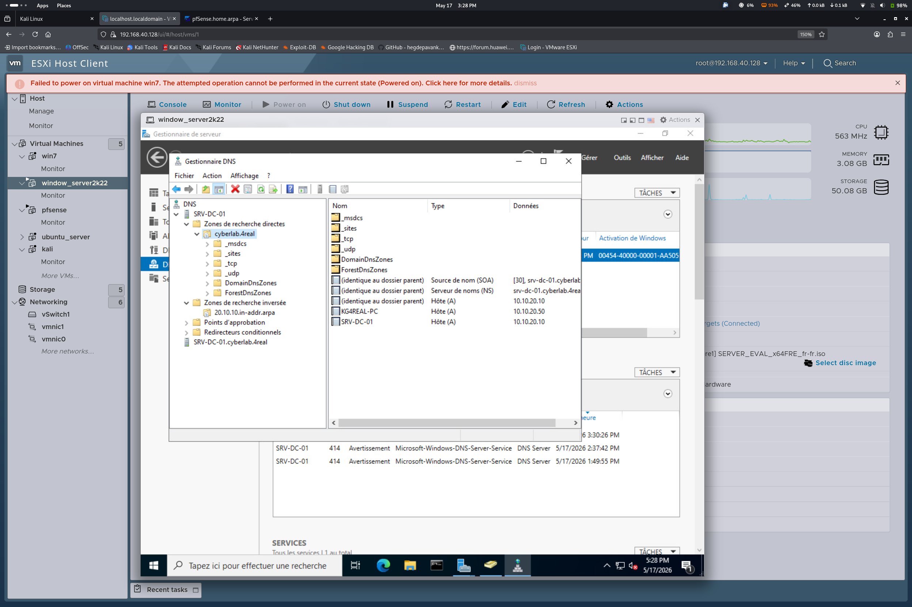
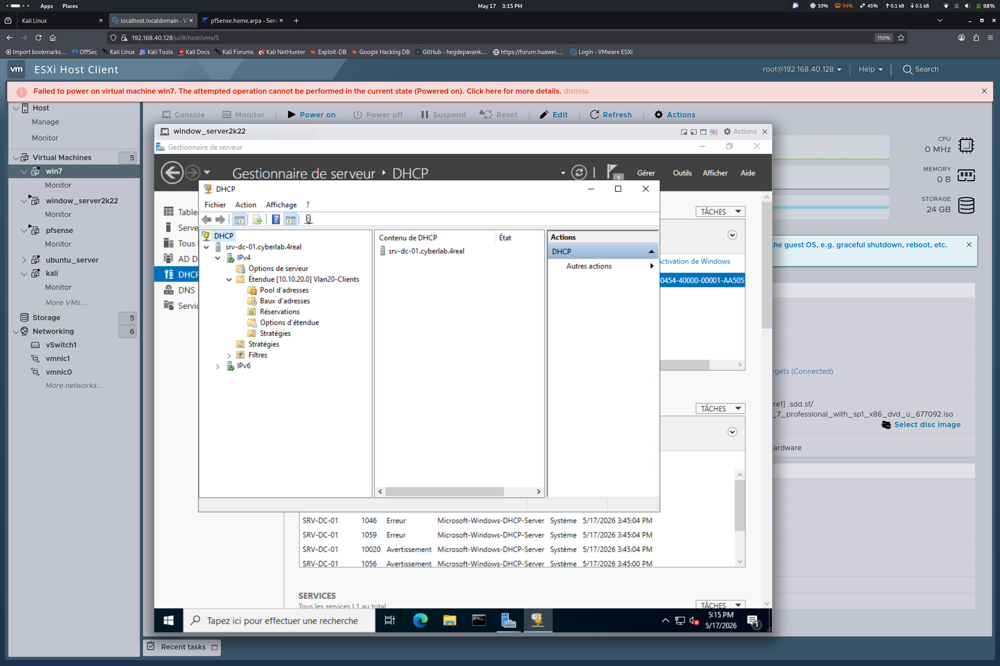
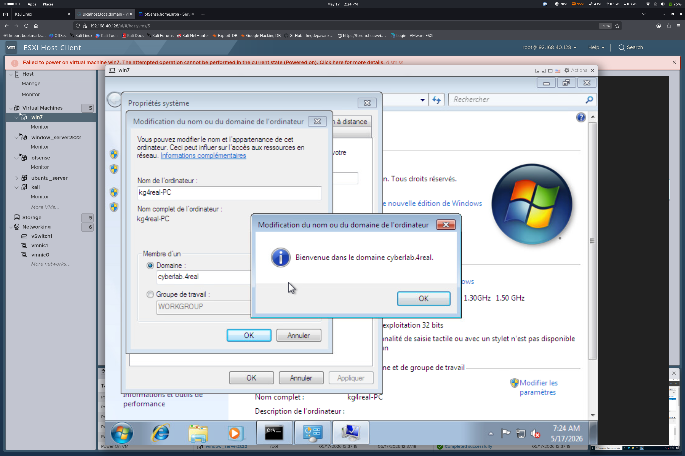
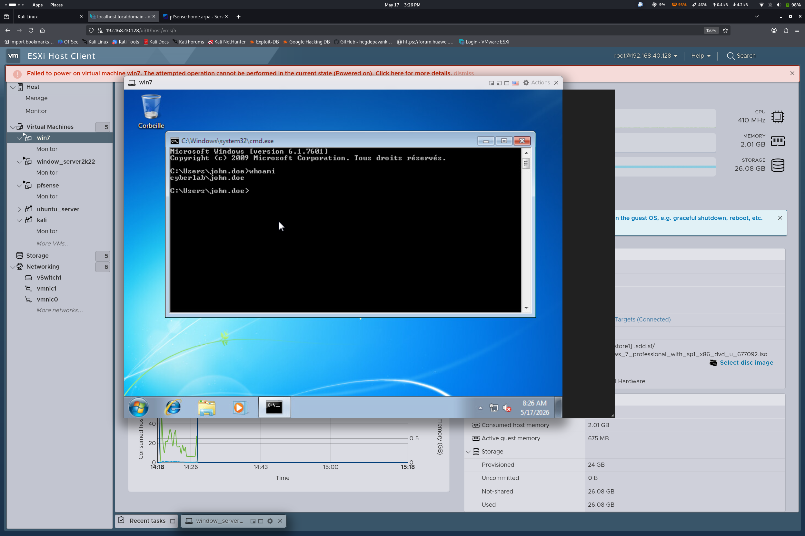

# CyberRange-ESXi 🔴🔵

> Enterprise Purple Team lab built on VMware ESXi — Active Directory, pfSense VLAN segmentation, Wazuh SIEM, full Red/Blue Team scenarios with attack documentation & detection rules.


## Architecture



## Network

| Host | IP | VLAN | Role |
|---|---|---|---|
| pfSense WAN | 192.168.40.150 | - | Firewall / Router |
| pfSense OPT1 | 10.10.10.254 | VLAN10 | RedTeam Gateway |
| pfSense OPT2 | 10.10.20.254 | VLAN20 | Targets Gateway |
| pfSense OPT3 | 10.10.30.254 | VLAN30 | SOC Gateway |
| Kali Linux | 10.10.10.10 | VLAN10 | Attacker |
| Windows Server 2022 | 10.10.20.10 | VLAN20 | DC01 / AD |
| Windows 7 | 10.10.20.51 | VLAN20 | Victim workstation |
| Ubuntu Server | 10.10.30.10 | VLAN30 | Wazuh SIEM |

## Infrastructure

### ESXi



### pfSense




### Active Directory





### Win7 Domain Join



## Scenarios

Full Active Directory attack chain, from initial recon to domain persistence.

| # | Scenario | Technique | MITRE | Status |
|---|---|---|---|---|
| 01 | [Recon, Password Spraying & Domain Compromise](04-scenarios/01-recon/README.md) | Nmap, enum4linux, NetExec | T1046, T1110.003 | ✅ |
| 02 | [Kerberoasting](04-scenarios/02-ad-attacks/README.md) | Impacket GetUserSPNs, Hashcat | T1558.003 | ✅ |
| 03 | [AS-REP Roasting](04-scenarios/03-asrep-roasting/README.md) | Impacket GetNPUsers, John the Ripper | T1558.004 | ✅ |
| 04 | [Pass-the-Hash](04-scenarios/04-pass-the-hash/README.md) | secretsdump, NetExec, wmiexec | T1550.002 | ✅ |
| 05 | Overpass-the-Hash (Pass-the-Key) | NTLM hash → forged Kerberos TGT | T1550.002 | 🔜 |
| 06 | Pass-the-Ticket | Stolen/replayed Kerberos tickets | T1550.003 | 🔜 |
| 07 | [LLMNR/NBT-NS Poisoning & NTLM Relay](04-scenarios/07-llmnr-ntlm-relay/README.md) | Responder, ntlmrelayx | T1557.001 | 🔜 |
| 08 | ACL Abuse (BloodHound attack paths) | GenericAll, WriteDACL, ForceChangePassword | T1222 | 🔜 |
| 09 | Delegation Abuse | Unconstrained / constrained Kerberos delegation | T1558 | 🔜 |
| 10 | DCSync | Credential dumping via directory replication | T1003.006 | 🔜 |
| 11 | Golden Ticket | Forged TGT using the krbtgt hash | T1558.001 | 🔜 |
| 12 | Silver Ticket | Forged TGS for a specific service | T1558.002 | 🔜 |
| 13 | [Privilege Escalation](04-scenarios/13-privesc/README.md) | WinPEAS, LinPEAS | T1068, T1078 | 🔜 |
| 14 | [Persistence](04-scenarios/14-persistence/README.md) | Registry/scheduled task, Skeleton Key, DCShadow | T1547.001, T1053.005 | 🔜 |
| 15 | GPO Abuse | Malicious Group Policy Object push | T1484.001 | 🔜 |
| 16 | [Web Exploitation](04-scenarios/16-web-exploitation/README.md) | Nikto, SQLmap, Burp Suite | T1190 | 🔜 |

Detection rules, IOCs, and the full MITRE ATT&CK mapping for every scenario live in [`05-detection/`](05-detection/).

## Tools

**Red Team** — Kali Linux, Nmap, Impacket, CrackMapExec, BloodHound, Responder, WinPEAS

**Blue Team** — Wazuh SIEM, Wireshark

**Infrastructure** — VMware ESXi, pfSense 2.7, PowerShell

## Structure

```
CyberRange-ESXi/
├── 01-infrastructure/    # ESXi, pfSense, network diagrams
├── 02-active-directory/  # AD setup & config
├── 03-soc-wazuh/         # Wazuh installation & config
├── 04-scenarios/         # Attack walkthroughs (01 → 07)
├── 05-detection/         # Wazuh rules, IOCs & MITRE mapping
└── 06-reports/           # Incident-response template & screenshots
```

## Roadmap

- [x] Infrastructure build-out (ESXi, pfSense, VLAN segmentation, AD, Wazuh)
- [x] Scenario 01 — Recon, Password Spraying & Domain Compromise
- [x] Scenario 02 — Kerberoasting
- [x] Scenario 03 — AS-REP Roasting
- [x] Scenario 04 — Pass-the-Hash
- [ ] Scenario 05 — Overpass-the-Hash
- [ ] Scenario 06 — Pass-the-Ticket
- [ ] Scenario 07 — LLMNR/NBT-NS Poisoning & NTLM Relay
- [ ] Scenario 08 — ACL Abuse (BloodHound attack paths)
- [ ] Scenario 09 — Delegation Abuse
- [ ] Scenario 10 — DCSync
- [ ] Scenario 11 — Golden Ticket
- [ ] Scenario 12 — Silver Ticket
- [ ] Scenario 13 — Privilege Escalation
- [ ] Scenario 14 — Persistence
- [ ] Scenario 15 — GPO Abuse
- [ ] Scenario 16 — Web Exploitation
- [ ] Full incident-response report using the [IR template](06-reports/incident-response/ir-template.md)

## Author

**Ibrahima Dia** — Cybersecurity student | Purple Team orientation

[](https://linkedin.com/in/ibrahima-dia-cyber)
[](https://github.com/Kg4REAL)
